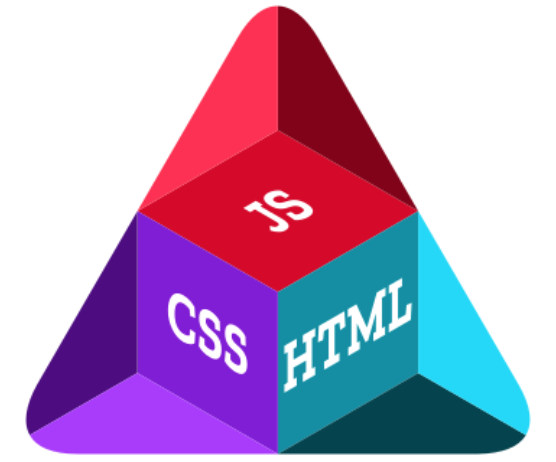
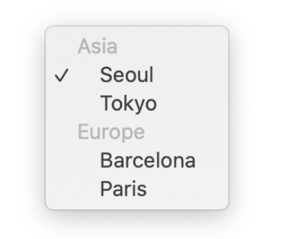
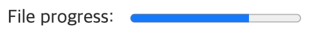

# HTML 요소 참고서(HTML elements reference)
모든 HTML 요소의 목록과 시멘틱 마크업(Semantic Markup)을 위한 요소별 설명을 다루고 있습니다.

<br />

## HTML 요소 목록(HTML elements list)
`<body>` 요소 내에서 쓰이는 요소들을 기능별로 분류한 목록입니다.

<br />

### Content sectioning
구획 요소를 사용해 페이지 콘텐츠의 큰 틀을 잡을 수 있습니다. 
- [`<header>`](#`<header>`)
- `<footer>`
- `<main>`
- `<section>`
- `<aside>`
- `<address>`
- `<article>`
- `<nav>`
- `<h1>-<h6>`
- `<hgroup>` : 다수의 `<h1>-<h6>` 요소를 묶을 때 사용합니다.

<br />

### Text content
해당 콘텐츠의 목적이나 구조 판별에 사용하므로 접근성과 SEO(검색 엔진 최적화)에 중요합니다.
- `<div>`
- `<main>`
- `<ul>`/`<ol>`/`<li>`
- `<dl>`/`<dt>`/`<dd>`
- `<p>`
- `<hr />`
- `<pre>`
- `<blockquote>`
- `<figure>`
- `<figcaption>`


<br />

### Inline text semantics
텍스트의 의미, 구조, 스타일을 정의할 수 있습니다.
- `<a>`
- `<abbr>`
- `<b>`
- `<bdo>`
- `<br />`
- `<cite>`
- `<code>`
- `<data>`
- `<dfn>`
- `<em>`/`<strong>`
- `<i>`
- `<kbd>`
- `<mark>`
- `<q>`
- `<ruby>`
- `<sub>`/`<sup>`
- `<u>`
- `<span>`
- `<time>`
>  더 많은 요소와 설명을 [여기](https://developer.mozilla.org/ko/docs/Web/HTML/Element)에서 볼 수 있습니다.

<br />

### Image and multimedia
사진, 오디오, 비디오 등 다양한 멀티미디어 리소스를 지원하는 요소입니다.
- ``
- `<audio>`
- `<video>`
- `<map>`
- `<area>`
- `<track>`
<br />

### Embedded content
일반적인 멀티미디어 콘텐츠 이외의 콘텐츠를 포함하는 요소입니다.
- `<iframe>`
- `<object>`

<br />

### Scripting
동적인 콘텐츠와 웹 어플리케이션을 위해 스크립트 언어(주로 JavaScript)를 지원하는 요소입니다.
- `<script>`
- `<noscript>`
- `<canvas>`

<br />

### Demarcating edits
텍스트의 특정 부분이 수정됐다는 것을 표시하는 요소입니다.
- `<del>`
- `<ins>`

<br />

### Table content
표 형식의 데이터를 나타내는 요소입니다.
- `<table>`
- `<thead>`/`<tbody>`
- `<th>`/`<tr>`/`<td>`
- `<caption>`
- `<col>`/`<colgroup>`

<br />

### Form
웹 서버에 데이터를 제출하기 위해 사용하는 양식(Form)을 구성하는 요소입니다. 여러가지 입력 가능한 요소를 제공합니다.
- `<form>`
- `<input />`
- `<label>`
- `<button>`
- `<select>`
- `<datalist>`
- `<option>`/`<optgroup>`
- `<textarea>`
- `<output>`
- `<progress>`
- `<fieldset>`/`<legend>`
- `<meter>` : 특정 범위 내에서의 스칼라 값, 또는 백분율 값을 나타냅니다.

<br />

### Interactive elements
상호작용 가능한 사용자 인터페이스 객체를 만들 때 사용할 수 있는 요소입니다.
- `<details>`
- `<dialog>`
- `<menu>`
- `<summary>`

<br />

### Web Components
완전히 새로운 형태의 요소를 생성한 후 일반적인 HTML처럼 사용할 수 있는 기술을 지원하는 요소입니다.
- `<slot>`
- `<template>`

<br /><br />

## `<h1> - <h6>`
제목의 정보를 사용해 자동으로 문서 콘텐츠의 표를 만드는 등의 작업을 수행할 수 있습니다. 제목 구획 단계는 `<h1>`이 가장 높고 `<h6>`은 가장 낮습니다.

- 글씨 크기를 위해 제목 태그를 사용하지 마세요. 대신 CSS의 `font-size` 속성을 사용하세요.
- 제목 단계를 건너뛰는 것을 피하세요. 언제나 `<h1>`로 시작해서 순차적으로 기입하세요.
- 페이지 당 하나의 `<h1>`만 사용하세요. `<h1>`은 가장 중요한 제목이므로 전체 페이지의 목적을 설명하고 이는 SEO(검색 엔진 최적화)와 연결됩니다.

<br /><br />

## `<header>`
제목, 로고, 검색 폼, 작성자 이름 등의 요소를 포함할 수 있습니다.

- `<header>` 또는 `<footer>`가 자손으로 올 수 없습니다.

<br /><br />

## `<footer>`
구획의 작성자, 저작권 정보, 관련 문서 등의 내용을 담습니다.

- `<header>` 또는 `<footer>`가 자손으로 올 수 없습니다.
- `<address>` 요소로 감싼 작성자 정보를 `<footer>` 요소에 배치하세요.

> 접근성 고려사항 : [VoiceOver](https://help.apple.com/voiceover/mac/10.15/) 스크린 리더는 랜드마크 로터에서 푸터의 랜드마크 역할을 표현하지 않는 문제가 있습니다. 해결하려면 `<footer>`에 `role="contentinfo"`를 추가하세요.

<br /><br />

## `<main>`
문서 `<body>`의 주요 콘텐츠를 나타냅니다. 

- IE 지원이 불가합니다. 
- (`hidden` 속성 없이는) 문서 전체에 하나의 `<main>` 요소만 존재해야 합니다.
- 해당 문서만의 유일한 내용을 담아야 합니다. 사이드바, 탐색 링크, 저작권 정보, 사이트 로고, 검색 Form 등 여러 문서에 걸쳐 반복되는 콘텐츠는 포함해선 안됩니다. 그러나 검색 폼이 페이지의 주요 기능이라면 예외로 둘 수 있습니다.
- 개요에 영향을 주지 않습니다. `<body>` 등의 요소나 `<h2>`와 같은 제목 요소와 달리, `<main>`은 페이지의 개념적 구조를 바꾸지 않으며 온전히 정보 제공용입니다.

> 브라우저 호환성 이슈 : Internet Explorer 11 이하를 지원할 땐 `<main>` 요소에 `"main"` [role](https://developer.mozilla.org/en-US/docs/Web/Accessibility/ARIA/ARIA_Techniques#Landmark_roles) [ARIA](https://developer.mozilla.org/en-US/docs/Web/Accessibility/ARIA/ARIA_Techniques) 역할을 명시해 접근성을 확보하는 것이 좋습니다.

```html
<main role="main">
  ...
</main>
```

<br /><br />

## `<article>`
독립 적으로 구분해 배포하거나 재사용 할 수 있는 구획을 나타냅니다. 사용 예제로 게시판과 블로그 글, 매거진이나 뉴스 기사 등이 있습니다. 

- 예를 들어, 사용자가 스크롤하면 계속해서 다음 글을 보여주는 블로그의 경우, 각각의 글이 `<article>` 요소가 될 수 있고, 그 안에는 또 여러 개의 `<section>`이 존재할 수 있습니다.
- 주로 제목 요소(`<h1>` ~ `<h6>`)를 포함하여 각각의 `<article>`을 식별합니다.
- `<article>` 요소 안에 `<article>` 요소를 중첩할 수 있습니다.
- 작성자 정보를 `<address>` 요소를 이용하여 제공할 수 있습니다. 그러나 중첩 `<article>`에는 적용되지 않습니다.
- 작성일자와 시간은 `<time>` 요소의 `datetime` 속성을 이용하여 설명할 수 있습니다.

<br /><br />

## `<section>`
독립적인 구획을 나타내며, 문서 요약에 해당 구획이 논리적으로 나타나야 할 때 사용합니다.

> 요소의 콘텐츠를 외부와 구분하여 단독으로 묶는 것이 나아보인다면 `<article>` 요소가 더 좋은 선택일 수 있습니다.

- 주로 제목 요소(`<h1>` ~ `<h6>`)를 포함하여 각각의 <article>을 식별합니다.
- `<section>` 요소는 `<address>`의 자손이 될 수 없습니다.
- `<section>` 요소를 일반 컨테이너로 사용하지 마세요. 특히 단순한 스타일링이 목적이라면 `<div>` 요소를 사용해야 합니다.

<br /><br />

## `<aside>`
문서의 주요 내용과 간접적으로만 연관된 부분을 나타냅니다. 주로 사이드바 혹은 콜아웃 박스로 표현합니다.

- `<aside>` 요소는 `<address>`의 자손이 될 수 없습니다.

다음 예제는 글 내의 문단을 `<aside>`로 표시합니다. 해당 문단은 글의 주제와 간접적으로만 연결되어 있습니다.
```html
<article>
  <p>
    디즈니 만화영화 <em>인어 공주</em>는
    1989년 처음 개봉했습니다.
  </p>
  <aside>
    인어 공주는 첫 개봉 당시 8700만불의 흥행을 기록했습니다.
  </aside>
  <p>
    영화에 대한 정보...
  </p>
</article>
```

<br /><br />

## `<nav>`
현재 페이지 내, 또는 다른 페이지로의 링크를 보여주는 구획을 나타냅니다. 자주 쓰이는 예제는 메뉴, 목차, 색인입니다.

- 문서의 모든 링크가 `<nav>` 요소 안에 있을 필요는 없습니다. `<nav>` 요소는 주요 탐색 링크 블록을 위한 요소입니다. 대개 `<footer>` 요소가 `<nav>`에 들어가지 않아도 되는 링크를 포함합니다.
- 하나의 문서에서 여러 개의 `<nav>` 태그를 가질 수 있습니다. 이럴 때 [`aria-labelledby`](https://developer.mozilla.org/ko/docs/Web/Accessibility/ARIA/ARIA_Techniques/Using_the_aria-labelledby_attribute) 를 사용해 접근성을 향상할 수 있습니다.
- 스크린 리더 등 장애를 가진 사용자를 위한 사용자 에이전트는 최초 렌더링에서 탐색 전용 콘텐츠를 제외할지 결정할 때 `<nav>`를 참고합니다.

<br /><br />

## `<address>`
사람, 단체, 조직 등에 대한 연락처 정보를 나타냅니다. 또한 `<article>` 내부에 배치해서 글의 작성자를 나타낼 수도 있습니다.

- `<address>` 요소는 `<address>`를 부모 요소로 가질 수 없습니다.
- `<address>` 요소 안에 반드시 포함해야 하는 정보는 연락처가 가리키는 개인, 조직, 단체의 이름입니다.
- 연락처 외의 정보(출판일 등)를 담아서는 안됩니다.

<br />

### 예제
```html
<address>
	<a href="mailto:imdud0612@gmail.com">imdud0612@gmail.com</a><br />
	<a href="tel:+13115552000">(311) 555-2000</a>
</address>
```

`<a href="mailto:...">` 를 클릭하면, 각 플랫폼에서 지원하는 메일 쓰기 페이지/앱으로 이동합니다. <br />
`<a href="tel:...">` 를 클릭하면, 각 플랫폼에서 지원하는 전화 앱으로 이동합니다.

<br /><br />

## `<div>`
아무 의미가 없는 영역을 나타냅니다. 스타일링 목적으로 사용합니다.

<br /><br />

## `<ul>`/`<ol>`/`<li>`
순서가 있는 목록(`<ol>`) / 순서가 없는 목록(`<ul>`)에 사용합니다. `<li>` 태그는 목록의 각 아이템입니다.

- `<ol>`과 `<ul>`은 자식으로 `<li>`만 올 수 있습니다.
- `<li>`는 단독으로 사용할 수 없습니다.
- 항목의 순서를 바꿨을 때 의미도 바뀐다면 `<ol>`을 사용하세요. (단계별 요리법, 내비게이션, 영양정보에서 비율의 내림차순으로 정렬한 원재료 목록)
- `<ul>` 요소에서 스타일적 요소의 넘버링이 필요하다면 CSS의 list-style 속성으로 제어할 수 있습니다.

<br />

### 속성
- `type` : 넘버링 타입 ()

    - `a` : lowercase letters
    - `A` : uppercase letters
    - `i` : lowercase Roman numerals
    - `I` : uppercase Roman numerals
    - `1` : numbers (default)
    
        > `<li>` 태그에 별도로 `type` 속성을 명시하지 않으면 `<ol>` 태그의 `type` 속성이 적용됩니다. 

- `reversed` : 역순 정렬 (Boolean)
- `start` : 아이템에 넘버링을 할 때 첫 번째 순서를 나타내는 숫자

     > type 값이 A와 같이 문자이더라도, start 속성 값은 3과 같이 숫자만 지정할 수 있습니다.

<br />

### 예제
```html
<ol type="1" reversed>
	<li>Mix flour, baking powder, sugar, and salt.</li>
	<li>In another bowl, mix eggs, milk, and oil.</li>
	<li>Stir both mixtures together.</li>
	<li>Fill muffin tray 3/4 full.</li>
	<li>Bake for 20 minutes.</li>
</ol>
```

<br />

### 속성

- `value` : `<ol>` 요소 내부에서 이 값에서부터 번호를 매깁니다. 숫자만 넣을수 있습니다. 

> 부모 `<ol>` 요소에서 지정하는 유형을 덮어쓰는 `type` 속성은 사용이 중단됐습니다. 대신 CSS [list-style-type](https://developer.mozilla.org/ko/docs/Web/CSS/list-style-type) 속성을 사용하세요.

<br /><br />

## `<dl>`/`<dt>`/`<dd>`
`<dl>` 태그는 설명 그룹의 목록을 나타냅니다. 설명 그룹은 용어(`<dt>`) + 정의(`<dd>`)를 한 그룹으로 합니다. 주로 용어사전 구현이나 메타데이터(키-값 쌍 목록)를 표시하는데 사용합니다. <br />
(Definition Term / Definition Details / Description List)

- `<dl>`은 `<dd>`, `<dt>`만을 포함해야 합니다.

<br />

### Styling
용어 그룹을 묶어서 스타일링할 때 `<div>` 태그를 사용할 수 있습니다.

```html
<dl>
	<div>
		<dt>Beast of Bodmin</dt>
		<dd>A large feline inhabiting Bodmin Moor.</dd>
	</div>

	<div>
		<dt>Morgawr</dt>
		<dd>A sea serpent.</dd>
	</div>

	<div>
		<dt>Owlman</dt>
		<dd>A giant owl-like creature.</dd>
	</div>
</dl>
```

<br />

### 웹 접근성 고려
일부 스크린 리더는 `<dl>`의 콘텐츠를 리스트로 표현하지 않습니다. 따라서, 각 아이템의 콘텐츠는 리스트 그룹 내 다른 항목과의 관계를 표현할 수 있는 방식으로 작성해야 합니다. <br /><br />
웹 접근성을 고려하여 `<ul>`과 `<dfn>` 태그를 사용할 수 있겠네요.

> `<dfn>`은 용어 하나를 정의하는 태그입니다.

```html
<ul>
	<li>
		<dfn>Beast of Bodmin</dfn>
		<p>A large feline inhabiting Bodmin Moor.</p>
	</li>

	<li>
		<dfn>Morgawr</dfn>
		<p>A sea serpent.</p>
	</li>

	<li>
		<dfn>Owlman</dfn>
		<p>A giant owl-like creature.</p>
	</li>
</ul>
```

<br /><br />

## `<p>`
하나의 문단을 나타냅니다. HTML에서 문단은 이미지나 입력 폼 등 서로 관련있는 콘텐츠 무엇이나 될 수 있습니다.

- 콘텐츠를 문단으로 나누면 페이지의 접근성을 높입니다. 스크린 리더 등의 보조 기기는 `<p>` 태그를 사용하여 다음 문단으로 넘어갈 수 있는 단축키 등을 제공합니다.

<br />

### 닫는 태그 생략
자신의 닫는 태그(`</p>`) 이전에 다른 블록 레벨 태그가 분석되면 자동으로 닫힙니다.

> 닫는 태그는 `<p>` 요소의 바로 뒤에 `<address>`, `<article>`, `<aside>`, `<blockquote>`, `<div>`, `<dl>`, `<fieldset>`, `<footer>`, `<form>`, `<h1>-<h6>`, `<header>`, `<hr>`, `<menu>`, `<nav>`, `<ol>`, `<pre>`, `<section>`, `<table>`, `<ul>`, `<p>` 요소가 위치하는 경우, 또는 부모 태그의 콘텐츠가 더 존재하지 않고 부모가 `<a>` 요소가 아닐 때 생략할 수 있습니다.

<br /><br />

## `<hr />`
문단을 분리합니다. 이야기 장면 전환, 구획 내 주제 변경 등 문단 레벨에서 주제의 분리를 나타냅니다.
> (Horizontal Rule)

- `<hr>`은 브라우저에서 시각적인 가로줄로 그려질 뿐만 아니라, 의미를 가집니다. 

<br />

### 예제
```html
<p>
This is the first paragraph of text. 
This is the first paragraph of text.
</p>

<hr>

<p>
This is second paragraph of text. 
This is second paragraph of text.
</p>
```

<br />

### Styling
`<hr />` 요소는 사실 단순한 가로줄이 아닌, 납작한 박스 형태입니다. 기본적으로 모든 요소는 사각형의 박스 형태를 하고 있죠. 따라서 `border` 속성 값을 아래와 같이 작성하면, 해당 `<hr />` 요소가 그려내는 가로줄의 두께는 2px이 됩니다.

```html
hr {
	border: 1px solid tomato;
}
```

가로줄을 숨기거나 꾸미려면 브라우저마다 제각각 적용된 `border` 스타일을 제거하세요. (`border: none`) 쓰면 됩니다.

```html
hr {
	border: none;
	border-top: 1px solid tomato;
}
```
위와 같이 하면 `<hr />` 가로줄의 두께는 1px 입니다.

<br /><br />

## `<pre>`
미리 서식을 지정한 텍스트를 나타내며, HTML에 작성한 내용 그대로 표현합니다. 내부에 [구문 콘텐츠](https://developer.mozilla.org/ko/docs/Web/Guide/HTML/Content_categories#%EA%B5%AC%EB%AC%B8_%EC%BD%98%ED%85%90%EC%B8%A0) 태그만 사용할 수 있습니다.
> (Preformatted Text)

<br />

### 접근성 고려사항
`<pre>` 요소로 만든 이미지나 도표에 대한 대체 설명을 지정하는 것이 중요합니다. 

```html
<figure role="img" aria-labelledby="cow-caption">
  <pre>
  _______________________
< 나는 이 분야의 전문가다. >
  -----------------------
         \   ^__^ 
          \  (oo)\_______
             (__)\       )\/\
                 ||----w |
                 ||     ||
  </pre>
  <figcaption id="cow-caption">
    소 한 마리가 "나는 이 분야의 전문가다"라고 말하고 있습니다. 소는 미리 서식을 적용한 텍스트로 그려져있습니다.
  </figcaption>
</figure>
```

위의 예시에서는 `<figure>`, `<figcaption>` 태그, `id` 속성, ARIA `role`, `aria-labelledby` 속성을 조합하여 사용했습니다. `<pre>` 요소를 마치 이미지처럼 표현하면서 `<figcaption>` 요소를 사용하여 대체 설명을 제공하고 있습니다.

<br /><br />

## `<blockquote>`
텍스트가 긴 인용문임을 나타냅니다. 주로 들여쓰기를 한 것으로 그려집니다.
> (Block Quotation)

- 인용문의 들여쓰기를 바꾸려면 CSS `margin-left`와 `margin-right`를 사용하세요.
- 별도의 블록을 쓰지 않아도 될 짧은 인용문은 `<q>` 요소를 사용하세요.

<br />

 속성|의미|값
 ---|---|---
 cite|인용문의 맥락 혹은 출처 정보를 가리키는 URL|URL
 
 <br />
 
 ### 예제
 ```html
<blockquote cite="https://www.huxley.net/bnw/four.html">
	<p>
		Words can be like X-rays, if you use them properly—they’ll go through
		anything. You read and you’re pierced.
	</p>
	<footer>—Aldous Huxley, <cite>Brave New World</cite></footer>
</blockquote>
```

<br /><br />

## `<a>`
다른 페이지나 같은 페이지의 어느 위치(`#id`), 파일, 이메일 주소와 그 외 다른 URL로 연결할 수 있는 하이퍼링크를 만듭니다. 
> Anchor

- `href` 속성을 통해 다른 URL로 이동할 수 있습니다.
- `<a>` 안의 콘텐츠는 링크 목적지의 설명을 나타내야 합니다.

<br />

### 속성
- `download` : 링크로 이동하는 대신 사용자에게 URL을 저장할지 물어봅니다. 값을 지정하면 저장할 때의 파일 이름으로서 제안합니다. `/`와 `\` 문자는 `_`로 변환합니다. 값이 없으면 파일 이름과 확장자는 브라우저가 다양한 인자로부터 생성해 제안합니다.
    > `download`는 [동일 출처 URL](https://developer.mozilla.org/ko/docs/Web/Security/Same-origin_policy) 과 `blob:`, `data:` 스킴에서만 작동합니다.
                                                                                                                                               
- `href` : 하이퍼링크가 가리키는 URL. 링크는 HTTP 기반 URL일 필요는 없고, 브라우저가 지원하는 모든 URL 스킴을 사용할 수 있습니다.
    - `tel:` URL을 사용하는 전화번호
    - `mailto:` URL을 사용하는 이메일 주소
- `ping` : 브라우저가 URL 각각에 POST 요청을 전송합니다. 대개 추적 용도로 사용합니다.
- `rel` : 연결한 URL과의 관계를 나타내는 [링크 유형](https://developer.mozilla.org/ko/docs/Web/HTML/Link_types) 목록입니다.
- `target` : 링크한 URL을 표시할 위치를 나타냅니다. 탭, 창, `<iframe>`의 이름이나 의미를 가지는 특정 키워드입니다.

    - `_self` : 현재 탭/창(기본값)
    - `_blank` : 새 탭/창
    - `_parent` : 현재 탭/창의 부모
    
        > 부모가 존재하지 않으면 `_self`와 동일하게 행동합니다.
                                      >
    - `_top` : 최상단 탭/창
    
        > 부모가 존재하지 않으면 `_self`와 동일하게 행동합니다.

<br />

### 보안 취약성
`target` 속성을 사용할 때, `rel="noreferrer"`를 추가해 `window.opener` API의 악의적인 사용을 방지하는걸 고려하세요.
> [Target="_blank" - the most underestimated vulnerability ever](https://www.jitbit.com/alexblog/256-targetblank---the-most-underestimated-vulnerability-ever/)

<br /><br />

## `<abbr>`
약어를 나타냅니다. 선택 속성인 `title`을 사용하면 준말의 전체 뜻이나 설명을 제공할 수 있습니다.
> Abbreviation

- `title` 속성 값은 전체 설명만을 작성하며, 다른건 포함할 수 없습니다.
- `title` 속성은 약어에 대한 설명/확장 형태를 사람이 읽을 수 있는 형태로 나타내야 합니다.
- 브라우저는 `title`의 값을 보통 마우스 커서를 올렸을 때 나타나는 툴팁(Tooltip)으로 보여줍니다.
- 설명 없이 단순히 해당 글자가 준말임을 나타내기만 하려면 `<abbr>` 태그를 속성 없이 사용하세요.
- `<abbr>`을 `<dfn>`과 같이 사용하면 준말이나 머리글자를 그 정의와 연결할 수 있습니다. 

<br />

### Styling
```css
abbr {
	font-variant: all-small-caps;
}
```

<br />

### 예제
```html
<abbr title="Cascading Style Sheets">CSS</abbr>
```

<br /><br />

## `<b>`
독자의 주의를 끌기 위해 사용합니다.
> Bring Attention

- 다른 태그가 적합하지 않은 경우 마지막 수단으로 사용하며 특별한 의미를 가지지 않습니다.
- 기본적으로 글자가 두껍게(Bold) 표시됩니다.

<br /><br />

## `<mark>`
맥락 내에서 사용자의 관심을 끌기 위해 하이라이트 효과를 줄 때 사용합니다.

- 기본적으로 형광펜을 사용한 것처럼 글자 배경이 노란색(Yellow)으로 표시됩니다.
- 인용문(`<q>`, `<blockquote>`)에서 주시해야 할 필요가 있는 부분을 표시합니다.
- 다른 경우, `<mark>`는 사용자와 관련하여 사용자가 검색한 현재 검색 키워드를 강조 표시할 때 사용할 수 있습니다.

> `<mark>`와 `<strong>` 요소의 차이점을 기억하세요. 텍스트에서, `<mark>`는 연관성을 가진 부분을, `<strong>`은 중요도를 가진 부분을 나타낼 때 사용합니다.

<br />

### 접근성 고려사항
대부분의 스크린 리더는 기본값에서 `<mark>` 요소의 존재를 표현하지 않습니다. 그러나 CSS content 속성과 ::before, ::after 의사 요소를 사용하면 소리내어 읽도록 할 수 있습니다.

```css
mark::before, 
mark::after {
  clip-path: inset(100%);
  clip: rect(1px, 1px, 1px, 1px);
  height: 1px;
  overflow: hidden;
  position: absolute;
  white-space: nowrap;
  width: 1px;
}

mark::before {
  content: " [강조 시작] ";
}

mark::after {
  content: " [강조 끝] ";
}
```

> 일부 사용자에게는 지나치게 자세한 안내를 유발할 수 있으므로 이 방식을 남용해서는 안됩니다. 콘텐츠의 이해에 강조표시의 유무가 꼭 필요할 때만 사용해야 합니다.

<br /><br />

## `<em>`
단순한 의미 강조를 표시합니다. 
> Emphasis

> `<em>`은 콘텐츠를 강조하지만, `<i>`는 외국어, 등장인물의 생각 등 일반적인 산문에서 벗어난 경우 사용합니다.

- 중첩될수록 강조 의미가 강해집니다.
- 스크린 리더에서 구두 강조로 발음됩니다.
- 기본적으로 이탤릭체(Italic type)로 표시됩니다.

<br /><br />

## `<strong>`
중대하거나 긴급한 콘텐츠를 나타냅니다.
> Strong importance

<br />

### 예제

```html
<p>Before proceeding, <strong>make sure you put on your safety goggles</strong>.</p>
```

<br /><br />

## `<i>`
텍스트에서 어떤 이유로 주위와 구분해야 하는 부분, 주변과 톤이 다른 부분에 사용합니다. (기술 용어, 외국어 구절, 등장인물의 생각, 아이콘 등)

- 기울임꼴(italic)로 표시됩니다.
- 강조하려는 텍스트가 다른 요소에 더 적합하지 않은지 고려하세요.
    - `<em>` 태그는 강세를 나타냅니다.
    - `<strong>` 태그는 보다 강한 강조를 나타냅니다.
    - `<mark>` 태그는 관련성을 나타냅니다.
    - `<cite>` 태그는 책, 공연, 음악 등 저작물의 이름을 나타냅니다.
    - `<dfn>` 태그는 정의 대상인 용어를 나타냅니다.

<br /><br />

## `<dfn>`
정의하고 있는 용어를 나타냅니다. `<dfn>`에서 가장 가까운 `<p>`, `<dt>`/`<dd>` 쌍, `<section>` 조상 요소를 용어 정의로 간주합니다.

- `<dfn>` 요소가 `title` 속성을 가지고 있으면 그 값을 현재 정의 중인 용어로 간주합니다. 
- `<dfn>`이 자식으로 `title` 속성을 가진`<abbr>`을 가지는 경우, 자식 `<abbr>`의 `title` 속성 값을 현재 용어로 간주합니다.
- `<dfn>` 요소에 `id` 속성을 지정하면 `<a>` 요소로 `<dfn>`을 가리킬 수 있습니다.

<br />

### 예제

```html
<p>The <strong>HTML Definition element</strong>
(<strong><dfn id="definition-dfn">&lt;dfn&gt;</dfn></strong>) is
used to indicate the term being defined within the context of a
definition phrase or sentence.</p>

<p>Because of all of that, we decided to use the
<code><a href="#definition-dfn">&lt;dfn&gt;</a></code> element for
this project.</p>
```
코드 뒤쪽에서는 `<a>` 태그와 `href` 속성 값 `"#definition-dfn"`으로, 정의를 가리키는 링크를 생성합니다.

<br /><br />

## `<cite>`
저작물의 출처를 표기할 때 사용하며, 제목을 반드시 포함해야 합니다.

- W3C 명세는 `<cite>` 요소로 저작물의 출처를 표기할 때 저작자도 표기할 수 있음을 명시하고 있습니다. 그러나 정반대로, WHATWG 명세는 사람 이름을 어떤 상황에서도 절대 포함하지 말아야 한다고 적혀있다는 점을 알아두는 것이 좋습니다.

<br /><br />

## `<q>`
짦은 인용문
> Quotation

- `<q>`는 줄 바꿈이 없는 짧은 경우에 적합합니다. 긴 인용문은 `<blockquote>` 요소를 사용하세요.
- 인용문의 출처 문서나 메시지를 가리키는 URL을 사용하기 위해 `cite` 속성을 이용할 수 있습니다.

<br /><br />

## `<u>`
HTML 5에서 `<u>` 요소는 텍스트가 일종의 문자가 아닌 주석(Non-textual annotation)을 가지고 있음을 나타냅니다. 철자 오류 강조, 중국어의 고유 명사 표시 등에 주로 쓰입니다.
> Unarticulated Annotation

- `<u>`를 사용해 밑줄만 추가하거나, 책 제목 등을 강조해서는 안됩니다.

    > 아무런 의미를 나타내지 않고 밑줄만 추가할 경우 `<span>` 요소를 사용하고, `text-decoration` 속성의 값은 `underline`으로 지정하세요.

<br />

### 예제

```html
<p>맞춤법을 틀리면 <u class="spelling">않돼요</u>.</p>
```

<br /><br />

## `<code>`
짧은 코드 조각을 나타냅니다.

- 여러 줄의 코드를 나타내려면 `<code>` 요소를 `<pre>`로 감싸세요. 보통 상황에서 `<code>`는 코드 한 줄만 나타냅니다.
```html
<p>The <code>push()</code> method adds one or more elements to the end of an array and returns the new length of the array.</p>
```

<br /><br />

## `<kbd>`
텍스트 입력 장치(키보드)에서 키보드 입력, 음성 입력을 나타냅니다.
> Keyboard Input

- `<kbd>` 요소를 다른 `<kbd>` 요소 안에 배치해, 하나의 입력 안의 작은 부분이나, 실제 타이핑 키를 하나씩 나타낼 수 있습니다.

```html
<p>Please press <kbd>Ctrl</kbd> + <kbd>Shift</kbd> + <kbd>R</kbd> to re-render an MDN page.</p>
```

<br /><br />

## `<sup>`/`<sub>`
위 첨자(`<sup>`)와 아래 첨자(`<sub>`)를 표시할 때 사용합니다.
> Superscripted text, Subscripted text

- `<sup>`/`<sub>` 요소는 기존의 관례나 표준이 아래 첨자로 나타내는 경우(타이포그래피)에만 써야 하며, 단순히 작은 글자를 아래로 올려야 할 때는 사용해서는 안됩니다.

    > 단순히 글씨 기준선을 올리거나 내려야 한다면 CSS `vertical-align: super`/`vertical-align: sub`를 사용할 수 있습니다. 기준선을 25% 내려야 한다면 `vertical-align: -25%`로 씁니다. 

```html
X<sup>4</sup> + Y<sup>2</sup>, H<sub>2</sub>O
```

<br /><br />

## `<time>`
시간의 특정 지점 또는 구간을 나타냅니다. `datetime` 속성을 지정하면 적절한 검색 결과, 알림 같은 특정 기능을 구현할 때 사용할 수 있습니다.

- `datetime` 속성이 없는 경우 어떠한 자식 요소도 두어서는 안되며, 요소의 텍스트 콘텐츠를 `datetime` 속성 값으로 간주합니다.

```html
<time datetime="2018-07-07">July 7</time>

<time datetime="20:00">20:00</time>

<time datetime="PT2H30M">2h 30m</time>
```
> [유효한 datetime 값](https://developer.mozilla.org/ko/docs/Web/HTML/Element/time) 을 확인하세요.

<br /><br />

## `<span>`
본질적으로는 아무것도 나타내지 않습니다. 주로 스타일을 적용하기 위해 사용합니다.

<br /><br />

## `<br />`
텍스트 안에 줄바꿈(캐리지 리턴)을 생성합니다. (주소나 시조 등 줄의 구분)

- 문단 사이에 여백을 두기 위한 용도로 `<br />`을 사용하지 마세요.
- `<br />` 요소에 CSS `margin`을 적용하면 줄 간격을 늘릴 수 있겠지만 좋은 방법은 아닙니다. 줄 간격은 `line-height` 속성을 사용하세요.
- 웹 접근성을 위해서는 `<br />` 대신 `<p>` 요소와 함께 CSS `margin` 속성 등을 조합해 간격을 조절하세요.

<br /><br />

## `<data>`
주어진 콘텐츠를 기계가 읽을 수 있는 해석본과 연결합니다.

- 콘텐츠가 시간 혹은 날짜 관련 정보라면 대신 `<time>` 요소를 사용하세요.
- 기계가 읽을 수 있는 형태의 콘텐츠 해석본은 `value` 속성으로 표시합니다.

<br />

### 예제
```html
<p>New Products:</p>
<ul>
    <li><data value="398">Mini Ketchup</data></li>
    <li><data value="399">Jumbo Ketchup</data></li>
    <li><data value="400">Mega Jumbo Ketchup</data></li>
</ul>
```
상품의 이름을 표시하면서, 각각의 상품 번호도 연결합니다.

<br /><br />

## `<ruby>`
루비 주석을 나타냅니다. 루비 주석은 동아시아 문자의 발음()을 표기할 때 사용합니다. 

```
<ruby>
明日 <rp>(</rp><rt>Ashita</rt><rp>)</rp>
</ruby>
```

<br /><br />

## ``
문서에 이미지를 넣습니다.

- `src` 속성은 필수이며, 포함하고자 하는 이미지로의 경로를 지정합니다.
- `alt` 속성은 이미지의 텍스트 설명을 합니다.
    > 스크린 리더가 `alt`의 값을 읽어 사용자에게 이미지를 설명하므로, 접근성 차원에서 매우 유용합니다. 또한 네트워크 오류, 콘텐츠 차단, 죽은 링크 등 이미지를 표시할 수 없는 경우에도 이 속성의 값을 대신 보여줍니다.
-  이미지가 부연 설명을 필요로 하는 경우 `<figure>`와 `<figcaption>` 요소를 사용하세요.
-  `srcset` 속성을 이용해 고해상도 버전 이미지를 추가할 수 있습니다.

<br />

## Styling

- ``는 [대체 요소](https://developer.mozilla.org/ko/docs/Web/CSS/Replaced_element) 입니다. 기본적으로 `display`는 `inline`이나,  `border`/`border-radius`, `padding`/`margin`, `width`, `height` 등의 속성을 이미지에 지정할 수 있습니다.
- ``는 기준선을 갖지 않으므로, `vertical-align: baseline`을 지정한 인라인 서식 맥락에서는 이미지의 아래쪽 모서리가 텍스트 기준선으로 가게 됩니다.
- 요소 박스 내의 이미지 위치는 `object-position` 속성으로 바꿀 수 있습니다. 크기는 `object-fit` 속성을 통해 요소 크기에 맞출지, 요소를 채울지 등을 지정할 수 있습니다.
- 이미지는 고유 너비와 높이를 가질 수 있지만, `<svg>` 요소는 `width`와 `height`가 없는 경우 고유 크기를 가지지 않습니다.

<br /><br />

## `<audio>`
문서에 소리 콘텐츠(MP3)를 포함할 때 사용합니다. `src` 속성 또는 `<source>` 요소를 사용해 한 개 이상의 오디오 소스를 지정할 수 있습니다.

- 부라우저가 오디오 소스를 지원하지 못할 경우를 대비해 다수의 `<source>` 요소를 제공할 수 있습니다. 부라우저는 첫번째 `<source>`부터 적용을 시도합니다.

```html
<audio controls>
  <source src="myAudio.mp3" type="audio/mpeg">
  <source src="myAudio.ogg" type="audio/ogg">
  <p>Your browser doesn't support HTML5 audio. Here is
     a <a href="myAudio.mp4">link to the audio</a> instead.</p>
</audio>
```
<br />

### 속성

- `autoplay` : 전체 오디오 파일의 다운로드를 기다리지 않고 바로 재생 (Boolean)	
    > [자동 재생 안내서](https://developer.mozilla.org/ko/docs/Web/Media/Autoplay_guide)를 확인하고 필요한 경우에만 `autoplay` 속성을 사용하세요.
- `controls` : 제어 메뉴를 표시	(Boolean)	
- `loop` : 재생이 끝나면 다시 처음부터 재생	(Boolean)
- `muted` : 음소거 여부, 기본값은 `false` (Boolean)	
- `preload` : 페이지가 로드될 때 파일을 로드할지 브라우저에게 알려줍니다. `autoplay`와 함께 쓰이면 `preload`는 무시됩니다.
    - `none` : 로드하지 않습니다.
    - `metadata` : 메타데이터만 로드합니다.
    - `auto` : 전체파일을 로드합니다.
- `src`

<br /><br />

## `<video>`
미디어 플레이어(MP4)를 문서에 삽입합니다.

- `<video></video>` 태그 안의 콘텐츠는 브라우저가 `<video>` 요소를 지원하지 않을 때 보여집니다.

<br />

### 속성
- `autoplay` : 전체 오디오 파일의 다운로드를 기다리지 않고 바로 재생 (Boolean)	
- `controls` : 제어 메뉴를 표시	(Boolean)	
- `loop` : 재생이 끝나면 다시 처음부터 재생	(Boolean)	
- `muted` : 음소거 여부, 기본값은 `false` (Boolean)	
- `poster` : 동영상 썸네일 이미지 URL
- `preload` : 페이지가 로드될 때 파일을 로드할지 브라우저에게 알려줍니다. `autoplay`와 함께 쓰이면 `preload`는 무시됩니다.
    - `none` : 로드하지 않습니다.
    - `metadata` : 메타데이터만 로드합니다.
    - `auto` : 전체파일을 로드합니다.
- `height`/`width`
- `src`


<br /><br />

## `<track>` 
미디어 요소(`<audio>`, `<video>`)의 자식으로서, 자막 등 시간별 텍스트 트랙(시간 기반 데이터)를 지정할 때 사용합니다. 
> 트랙은 `.vtt` 파일 또는 [Timed Text Markup Language(TTML)](https://w3c.github.io/ttml2/index.html) 형식을 사용해야 합니다.

- `<track>` 요소가 미디어에 추가하는 데이터의 유형은 `kind` 속성으로 나타낼 수 있습니다.
- 사용자가 추가 데이터를 요청하는 경우, 브라우저는 `<track>` 요소가 가리키는 시간별 텍스트 데이터를 보여줍니다.
- 미디어 요소는 동일한 `kind`, `srclang`, `label`을 가진 `<track>`을 하나만 포함할 수 있습니다.

<br /><br />

## `<map>`
이미지 맵을 정의하기 위해 사용합니다. 이미지 맵이란, 이미지에서 클릭할 수 있는 링크 영역을 의미합니다.

- `<area>` 태그와 함께 사용합니다.
```html
<map name="infographic">
	<area
		shape="poly"
		coords="130,147,200,107,254,219,130,228"
		href="https://developer.mozilla.org/docs/Web/HTML"
		target="_blank"
		alt="HTML"
	/>
	<area
		shape="poly"
		coords="130,147,130,228,6,219,59,107"
		href="https://developer.mozilla.org/docs/Web/CSS"
		target="_blank"
		alt="CSS"
	/>
	<area
		shape="poly"
		coords="130,147,200,107,130,4,59,107"
		href="https://developer.mozilla.org/docs/Web/JavaScript"
		target="_blank"
		alt="JavaScript"
	/>
</map>

```



<br />

### 속성
- `name` 이미지 맵의 이름, 문서의 다른 부분에서 해당 맵을 참조할 때 해쉬(`#`)를 붙여 사용
    - 반드시 존재해야 합니다.
    - 값이 비면 안됩니다.
    - 값에 공백 문자가 포함 될 수 없습니다.
    - `name` 속성은 문서 내의 모든 <map>에서 유일해야 합니다.
    - `id` 속성이 존재하는 경우 `name`과 값이 동일해야 합니다.

<br /><br />

## `<figure>`/`<figcaption>`
`<figure>`는 독립적인 콘텐츠 영역을 설정합니다.
`<figcaption>`는 `<figure>`에 포함되어 설명을 표시합니다. (Figure Caption)

- 보통 `<figure>`는 다른 부분이나 부록으로 이동해도 문제 없는 이미지, 삽화, 도표, 코드 조각 등을 맡습니다.

<br />

### 예제
```html
<figure>
    
    <figcaption>An elephant at sunset</figcaption>
</figure>
```

```html
<figure>
  <figcaption><code>navigator</code>를 이용하여 브라우저 정보 얻기</figcaption>
  <pre>
    function NavigatorExample() {
      var txt;
      txt = "Browser CodeName: " + navigator.appCodeName;
      txt+= "Browser Name: " + navigator.appName;
    }            
  </pre>
</figure>
```

<br /><br />

## `<iframe>`
현재 문서 안에 다른 HTML 페이지를 삽입합니다. (중첩 [브라우징 맥락](https://developer.mozilla.org/en-US/docs/Glossary/Browsing_context))

- inline 요소입니다.
- 페이지에 `<iframe>`을 추가할 때마다 메모리 및 기타 컴퓨터 자원 사용량이 늘어납니다. 

<br />

### 속성

- `name` : 프레임의 이름, 이 이름을 사용해서 다른 요소(`<a>`, `<form>`, `<base>`)나 웹 API(`window.open()`)에서 해당 프레임을 타겟팅 할 수 있습니다.
- `allowfullscreen` :  전체 화면 모드 사용 여부 (Boolean)
    - 레거시 속성으로 `allow="fullscreen"`으로 사용해야 합니다.
- `sandbox` : 보안을 위해 읽기 전용으로 삽입, (Boolean) 또는 속성 값(일부 접근만 허용)
    - `allow-forms` : `Form` 제출을 허용합니다.
    - `allow-scripts` : 프레임 문서의 JavaScript 동작을 허용합니다.
    - `allow-same-origin` : 동일 출처 리소스 사용을 허용합니다. 명시하지 않으면, 무조건 동일 출처 정책에 위배되는 리소스로 간주합니다.
    
        > [`sandbox` 속성 값 모두 보기](https://developer.mozilla.org/ko/docs/Web/HTML/Element/iframe)
- `height`/`width`
- `src`

> `frameborder`는 더이상 사용하지 않는 속성입니다.    

<br /><br />

## `<object>`
외부 리소스를 나타내기 위해 사용합니다. `<object>` 요소는 이미지, 새로운 브라우징 맥락, 플러그인으로 작동시키는 리소스 등으로 인식됩니다.

```html
<!-- Embed a flash movie -->
<object data="move.swf" type="application/x-shockwave-flash"></object>

<!-- Embed a flash movie with parameters -->
<object data="move.swf" type="application/x-shockwave-flash">
  <param name="foo" value="bar">
</object>
```
`<object>` 요소의 `data`, `type`, `form`, `name`, `usemap` 속성을 제외한, 대부분의 속성들이 HTML5 이후로 Deprecated 되었습니다.

<br />

### 속성
- `data` : 리소스 URL
- `type` : 리소스 포맷/타입
- `form` : 문서 내 `<form>` 태그의 `id` 값을 이 속성 값으로 지정하면, 해당 폼과 외부 리소스를 연결
- `name` : 유효한 새로운 브라우징 맥락이 있다면, 브라우징 맥락의 이름 지정
- `usemap` : 해쉬이름(`#`)을 사용하여 `<map>` 태그를 연결

<br /><br />

## `<script>`
Script 코드를 문서에 포함하거나 참조합니다.

- 브라우저가 HTML 문서 분석을 진행하다가 인라인 스크립트 또는 `async`, `defer`, `type="module"` 속성이 없는 `<script>` 태그를 만나면 해당 `<script>` 태그가 참조하는 JS 코드 실행하기 전까지 문서 분석을 중단합니다.

<br />

### 속성
`async`와 `defer` 속성은 `src` 속성이 필수입니다.

- `async` : 스크립트의 비동기적(Asynchronously) 실행 여부 (Boolean)
- `defer` : 브라우저가 스크립트를 문서 분석 이후에, 그러나 DOMContentLoaded 발생 이전에 실행할지 지정 (Boolean)
- `src` : 참조할 외부 스크립트 URL
- `type` : MIME 타입, text/javascript(기본값)

<br /><br />

## `<noscript>`
페이지의 스크립트 유형을 지원하지 않거나, 브라우저가 스크립트를 비활성화한 경우 보여줄 HTML 구획을 정의합니다.

```html
<noscript>
  <p>Your browser does not support JavaScript!</p>
</noscript>
```

<br /><br />

## `<canvas>`
[Canvas API](https://developer.mozilla.org/ko/docs/Web/HTML/Canvas) 이나 [WebGL API](https://developer.mozilla.org/ko/docs/Web/API/WebGL_API) 를 사용하여 그래픽이나 애니메이션을 랜더링합니다.

- 웹 접근성을 위해 `<canvas>` 블록 안에 대체 콘텐츠를 제공하세요.
- 대체 콘텐츠는 캔버스를 지원하지 않는 구형 브라우저와, JavaScript를 비활성화한 브라우저에서 표시됩니다.
- `<canvas>` 요소는 닫는 태그(`</canvas>`)를 필요로 합니다.
- `<canvas>` 요소의 크기는 CSS가 아닌 HTML 에서 `width`와 `height` 속성을 통해 직접 크기를 바꾸세요. JavaScript를 사용할 수도 있습니다.
- 최대 캔버스 크기는 브라우저마다 다릅니다.

<br />

### 예제

#### HTML
```html
<canvas id="canvas" width="300" height="300">
  캔버스의 내용을 설명하는 대체 텍스트
</canvas>
```

#### JavaScript
```javascript
var canvas = document.getElementById('canvas'); 
var ctx = canvas.getContext('2d'); 
ctx.fillStyle = 'green'; 
ctx.fillRect(10, 10, 100, 100);
```
JavaScript 코드 내에서 `HTMLCanvasElement.getContext()`를 호출해 그리기 맥락을 얻어서 캔버스 위에 그립니다.

<br />

### 웹 접근성 문제
`<canvas>` 요소 자체는 비트맵에 불과하며 어떠한 정보도 제공하지 않습니다. 대체 컨텐츠 이외에 캔버스 접근성을 높이는 사용법을 알아보세요.
- [히트(Hit) 영역과 접근성](https://developer.mozilla.org/ko/docs/Web/HTML/Canvas/Tutorial/Hit_regions_and_accessibility)
- [Canvas 접근성 유즈 케이스](https://www.w3.org/WAI/PF/HTML/wiki/Canvas_Accessibility_Use_Cases)
- [Canvas 엘리먼트 접근성 문제](https://www.w3.org/html/wg/wiki/AddedElementCanvas)
- [대화형 캔버스 엘리먼트의 모범 사례](https://html.spec.whatwg.org/multipage/canvas.html#best-practices)

<br /><br />

## `<del>`/`<ins>`
문서에서 제거된 텍스트의 범위(`<del>`), 문서에 추가된 텍스트의 범위(`<ins>`)를 나타냅니다. 문서나 소스 코드의 변경점 추적 등에 사용할 수 있습니다.

```html
<blockquote>
    There is <del>nothing</del> <ins>no code</ins> either good or bad, but <del>thinking</del> <ins>running it</ins> makes it so.
</blockquote>
```

<br />

### 속성
- `cite` : 회의록, 이슈 추적 시스템의 티켓 번호 등 변경점을 설명하는 리소스의 URI
- `datetime` : 변경이 발생한 일시
    - [유효한 날짜 문자열](https://developer.mozilla.org/ko/docs/Web/HTML/Date_and_time_formats) 로 표현해야 합니다.

<br />

### 접근성 고려사항
대부분의 스크린 리더는 기본값에서 `<del>`/`<ins>` 요소의 존재를 표현하지 않습니다. CSS `content` 속성과 `::before`, `::after` 의사 요소를 사용하면 소리내어 읽도록 할 수 있습니다.
그러나 일부 스크린 리더 사용자에게 지나치게 자세한 안내를 유발 할 수 있기 때문에, 콘텐츠의 이해에 삭제 여부가 꼭 필요할 때만 사용해야 합니다.

```html
del::before, 
del::after {
  clip-path: inset(100%);
  clip: rect(1px, 1px, 1px, 1px);
  height: 1px;
  overflow: hidden;
  position: absolute;
  white-space: nowrap;
  width: 1px;
}

del::before {
  content: " [제거 부분 시작] ";
}

del::after {
  content: " [제거 부분 끝] ";
}
```

<br /><br />

## `<table>`
행과 열로 이루어진 표를 나타냅니다.

- 표의 목적에 대한 명확하고 상세한 설명을 포함하는 `<caption>` 요소를 제공하여 사용자가 표 콘텐츠를 확인할지, 넘어갈지 결정할 때 도움을 줄 수 있습니다.

```html
<table>
    <caption>Council budget (in £) 2018</caption>
    <thead>
        <tr>
            <th>Items</th>
            <th scope="col">Expenditure</th>
        </tr>
    </thead>
    <tbody>
        <tr>
            <th scope="row">Donuts</th>
            <td>3,000</td>
        </tr>
        <tr>
            <th scope="row">Stationery</th>
            <td>18,000</td>
        </tr>
    </tbody>
</table>
```

```html
<table>
    <caption>Superheros and sidekicks</caption>
    <colgroup>
        <col>
        <col span="2" class="batman">
        <col span="2" class="flash">
    </colgroup>
    <tr>
        <td> </td>
        <th scope="col">Batman</th>
        <th scope="col">Robin</th>
        <th scope="col">The Flash</th>
        <th scope="col">Kid Flash</th>
    </tr>
    <tr>
        <th scope="row">Skill</th>
        <td>Smarts</td>
        <td>Dex, acrobat</td>
        <td>Super speed</td>
        <td>Super speed</td>
    </tr>
</table>
```

<br />

### Styling
`border-collapse`을 이용해 테이블 각 칸의 테두리가 서로 분리되지 않고 공유하도록 지정할 수 있습니다.
`<thead>`는 CSS의 가상클래스(pseudo-class) `:nth-child` 을 사용하면 열의 칸(cell)들을 정렬하는데 유용합니다.

<br /><br />

## `<caption>`
표의 설명 또는 제목을 나타냅니다.

- `<caption>` 요소는 부모 `<table>` 요소의 첫 번째 자식이어야 합니다.
- `<table>` 요소가 만약 `<figure>` 요소의 유일한 자식인 경우, `<figcaption>`을 대신 사용하세요.

<br /><br />

## `<col />`/`<colgroup>`
`<col />`는 표의 열을 나타내며, 열에 속하는 칸(cell)에 공통된 의미를 부여할 때 사용합니다. `<colgroup>`는 `<col />`를 묶는 그룹을 나타냅니다.

- `span` 속성을 사용하여 차지할 열의 수를 양의 정수로 나타냅니다. (기본값 1)
- `<colgroup>`은 내부에 `<col>` 요소가 존재 하면 `span` 속성을 사용할 수 없습니다.

<br /><br />

## `<thead>`, `<tbody>`
표의 머리글(`<thead>`), 본문(`<tbody>`)을 나타냅니다.

- 기본적으로 테이블의 레이아웃에 영향을 주지 않습니다.
- `<thead>` 요소를 사용한 경우, `<tbody>` 요소는 반드시 그 뒤에 위치해야 합니다.
- `<thead>`의 닫는 태그는 바로 뒤에 `<tbody>`가 올 경우 생략할 수 있습니다.
- `<thead>`는 무조건 `<caption>`이나 `<colgroup>` 요소 다음에 위치 해야 하며, `<tbody>`나 `<tr>` 요소 이전에 위치 해야 합니다.
- 하나의 표에 다수의 `<tbody>`를 연속적으로 사용하여, 커다란 표의 행을 구획으로 나눌 수 있습니다.
- 브라우저에서 지정된 화면 영역이 표 전체를 보여주기에 충분히 크지 않은 경우, 같은 부모의 `<thead>`/`<tbody>`/`<caption>` 요소를 서로 따로 스크롤 가능토록 설정할 수 있습니다. 

<br /><br />

## `<th>`
테이블에서 ‘머리글 칸’을 지정합니다.
> Table Header

- 복잡한 표에서는 `scope` 속성을 통해 범위를 명시하세요. 특정 헤더와 연관된 칸에 대한 정보를 제공할 수 있습니다.

<br />

### 속성

- `abbr` : 열에 대한 간단한 설명
- `headers` : 관련된 하나 이상의 다른 머리글 칸 `id` 속성 값		
- `colspan` : 확장하려는(병합) 열의 수, 기본값 1
- `rowspan` : 확장하려는(병합) 행의 수, 기본값 1
- `scope` : 자신이 누구의 ‘머리글 칸’인지 명시
    - `col` : 자신의 열
    - `colgroup` : 모든 열
    - `row` : 자신의 행
    - `rowgroup` : 모든 행
    - `auto` (기본값) 

<br /><br />

## `<td>`
데이터를 포함하는 표의 셀을 정의합니다. 테이블의 행을 나타내는 `<tr>` 안에 위치합니다.

<br />

### 속성
- `headers` : 관련된 하나 이상의 다른 머리글 칸 `id` 속성 값		
- `colspan`	: 확장하려는(병합) 열의 수
    - `0` : `<colgroup>`의 크기만큼 확장
    - `1` : (기본값)
- `rowspan`	: 확장하려는(병합) 행의 수
    - `0` : table section(`<thead>`, `<tbody>`)의 크기만큼 확장
    - `1` : (기본값)

<br /><br />

## `<form>`
웹 서버에 정보를 제출하기 위한 양식 범위를 정의합니다. 

<br />

### 속성
양식의 고유한 이름은 `id`를 사용하세요. `name` 속성은 HTML4부터 사용하지 않습니다.

- `action` : 전송한 정보를 처리할 웹페이지의 URL
- `autocomplete` : 사용자가 이전에 입력한 값으로 자동 완성 기능을 사용할 것인지 여부
    - `on` : 사용 (기본값)
    - `off` : 미사용
- `method` : 서버로 전송할 HTTP 방식
    - `get` : (기본값)
    - `post`
    - `dialog` : `<form>`이 `<dialog>` 요소 안에 위치한 경우, 제출과 함께 대화 상자를 닫습니다.
- `enctype` : `method` 속성이 `post`인 경우, 양식 제출 시 데이터의 [MIME 유형](https://ko.wikipedia.org/wiki/%EB%AF%B8%EB%94%94%EC%96%B4_%ED%83%80%EC%9E%85) 을 나타냅니다. 
    - `application/x-www-form-urlencoded` : (기본값)
    - `multipart/form-data` : `<input type="file">`이 존재하는 경우 사용하세요.
    - `text/plain` : HTML 5에서 디버깅 용으로 추가된 값	
- `novalidate` : 서버로 전송시 양식 데이터의 유효성을 검사하지 않도록 지정		
- `target` : 서버로 전송 후 응답받을 방식을 지정

<br /><br />

## `<input />`
사용자의 데이터를 받을 수 있는 대화형 컨트롤을 생성합니다.
`<input />` 요소는 [여기](https://developer.mozilla.org/ko/docs/Web/HTML/Element/Input)에서 확인해주세요.

<br /><br />

## `<label>`
사용자 인터페이스 항목의 설명을 나타냅니다.

- 라벨 가능 요소는 `<button>`, `<input>`, `<progress>`, `<select>`, `<textarea>` 입니다.
- `<label>`의 `form` 속성 값에 동일한 문서의 `<form>` 요소의 `id`를 연결시킬 수 있습니다.
- `<label>` 요소 내에 포함된 어떤 것을 눌러도 체크박스 체크/해제가 됩니다.

    ```html
    <label><input type="checkbox" />I agree.</label>
    ```

- `<label>` 요소 내에 포함된 텍스트를 클릭하면, 해당 요소의 `for` 속성으로 참조된 체크박스가 체크/해제 됩니다.

    ```html
    <input type="checkbox" id="check-agreement" />
    <label for="check-agreement">I agree.</label>
    ```
    하지만, 되도록 위의 방법을 사용하세요.

<br />

### 접근성 고려사항
- `<label>` 내에 `<a>` 또는 `<button>`와 같은 인터랙티브 요소를 배치하지 마세요. 사용자가 `label`과 관련된 양식을 입력하기 어렵습니다.
- `<label>` 내에 제목 요소(`<h1>`-`<h6>`)를 배치하면 많은 종류의 보조 기술을 방해합니다. 제목이 필요한 경우 `<fieldset>` 내에 배치 된 `<legend>` 요소를 사용하세요.

<br /><br />

## `<button>`
`<button>` 요소는 간단한 표준 버튼 기능이 필요한 곳이라면 양식(form)과 상관없이 문서 어디에나 배치할 수 있습니다. 양식(form) 제출용 버튼이 아니라면 `type` 값을 `button`으로 지정하는걸 잊지 마세요.

<br />

### 속성
- `type`
    - `submit` : 양식(form) 제출 (기본값)
    - `reset`: 모든 컨트롤을 초기값으로 초기화
    - `button` : 단순 버튼
- `autofocus` : 페이지가 로드될 때 자동으로 포커스 (Boolean), 문서 내에 고유해야 합니다.
- `disabled` : 버튼을 비활성화 (Boolean)	
- `form` : 동일한 문서의 `<form>` 요소의 `id`를 사용해 버튼과 연결할 수 있고, 조상 중 `<form>`이 있더라도 소유자를 재정의할 수 있습니다.
- `name` : 양식(form) 제출할 때, 버튼의 `value` 속성과 함께 제출합니다.
- `value` : 버튼의 초기값

<br />

### 접근성 고려사항

- 버튼과 같은 대화형 요소는 최소 `44x44`의 CSS 픽셀 크기를 권고합니다.
- 다수의 버튼을 시각적으로 가까이 배치할 땐 서로를 분리하는 공간을 둬야 합니다. `margin`과 같은 CSS 속성으로 설정하세요.
- 아이콘만 사용해 기능을 표현하는 버튼은 `<button>` 요소의 기능을 간략히 묘사하는 텍스트를 안에 포함하세요.
- 텍스트를 숨기고 싶은 경우, 이렇게 CSS를 조합해보세요.

    ```css
     /* Visually hide an element, but leave it available for screen readers */
    .screen-reader {
        border: 0;
        clip: rect(0 0 0 0);
        height: 1px;
        margin: -1px;
        overflow: hidden;
        padding: 0;
        position: absolute;
        white-space: nowrap;
        width: 1px;
    }
    
    /* Extends the .screen-reader class to allow the element to be focusable when navigated to via the keyboard */
    .screen-reader-focusable:active,
    .screen-reader-focusable:focus {
        clip: auto;
        height: auto;
        margin: 0;
        overflow: visible;
        position: static;
        white-space: normal;
        width: auto;
    }
    ```
    ```html
    <a class="screen-reader screen-reader-focusable" href="#main">Skip to the main content</a>
    
    <nav>Navigation elements...</nav>
    
    <main id="main">The main content</main>
    ```

<br /><br />

## `<textarea>`
여러 줄의 일반 텍스트 편집 컨트롤을 나타냅니다.

- `<textarea>`는 CSS property `resize`가 가능한 것이 기본값입니다. `resize`가 되지 않도록 바꿀 수 있습니다.
   
    ```css
    textarea {
      resize: none;
    }
    ```

<br />

### 속성
- `autocomplete` : 사용자가 이전에 입력한 값으로 자동 완성 기능을 사용할 것인지 여부
    - `on` : 사용 (기본값)
    - `off` : 미사용
- `autofocus` : 페이지가 로드될 때 자동으로 포커스 (Boolean), 문서 내에 고유해야 합니다.
- `disabled` : 양식을 비활성화 (Boolean)	
    - 속성이 지정되지 않았다면, 이 요소를 포함하는 컨테이닝 요소(예: `<fieldset>`)에게서 값을 상속받습니다.
    - `disabled` 속성을 가진 컨테이닝 요소가 없다면, 컨트롤은 사용 가능합니다.
- `form` : 동일한 문서의 `<form>` 요소의 `id`를 사용해 버튼과 연결할 수 있고, 조상 중 `<form>`이 있더라도 소유자를 재정의할 수 있습니다.
- `name`			
- `placeholder`			
- `readonly`		
- `rows` : 보여지는 컨트롤의 줄의 수
- `maxlength`/`minlength`

> 더 많은 [속성](https://developer.mozilla.org/ko/docs/Web/HTML/Element/textarea) 을 살펴보세요.

<br />

### 예제

```html
<label for="story">Tell us your story:</label>

<textarea id="story" name="story"
          rows="5" cols="33">
It was a dark and stormy night...
</textarea>
```

<br /><br />

## `<fieldset>`/`<legend>`
같은 목적의 양식을 그룹화(`<fieldset>`)하여 제목(`<legend>`)을 지정합니다.

```html
<form>
	<fieldset>
		<legend>Choose coffee size</legend>
		<label><input type="radio" name="size" />Small</label><br />
		<label><input type="radio" name="size" />Big</label><br />
		<label><input type="radio" name="size" />Super</label>
	</fieldset>
</form>
```

<br />

### `<fieldset>` 속성
- `disabled` : 지정한 경우, 모든 자손 컨트롤을 비활성화합니다. 단, `<legend>` 안의 양식 요소는 비활성 상태로 전환되지 않습니다.
- `form` : 동일한 문서의 `<form>` 요소의 `id`를 사용해 버튼과 연결할 수 있습니다.
- `name` : 그룹과 연관지을 이름, `<fieldset>`에 대한 설명은 자신이 포함한 첫 번째 `<legend>` 요소가 담당합니다.

<br />

### Styling
- `<fieldset>`은 기본 스타일 값을 가집니다. 예를 들어, 크롬 브라우저에서 `<fieldset>` 요소의 스타일 기본값은 아래와 같습니다.

    ```css
    fieldset {
        display: block;
        min-inline-size: min-content;
        margin-inline-start: 2px;
        margin-inline-end: 2px;
        padding-block-start: 0.35em;
        padding-inline-start: 0.75em;
        padding-inline-end: 0.75em;
        padding-block-end: 0.625em;
        border-width: 2px;
        border-style: groove;
        border-color: threedface;
        border-image: initial;
    }
    ```

    `<fieldset>` 요소를 `display: inline`으로 지정하면 `inline-block`처럼 행동합니다. <br />
    `<legend>` 요소의 `display` 기본값 역시 `block` 입니다. 그러나, `<legend>` 요소는 `display: inline`으로 지정해도 `block`처럼 동작한다는 점에 주의하세요.

- Microsoft Edge와 Google Chrome에는 `<fieldset>` 내부에서 `flexbox`와 `grid layout`을 사용할 수 없는 버그가 존재합니다.

<br /><br />

## `<select>`
옵션 메뉴를 제공하는 컨트롤을 나타냅니다.

```html
<label for="pet-select">Choose a pet:</label>
<select name="pets" id="pet-select">
    <option value="">--Please choose an option--</option>
    <option value="dog">Dog</option>
    <option value="cat">Cat</option>
    <option value="hamster">Hamster</option>
</select>
```

<br />

### 속성
- `autocomplete`
- `disabled`
- `autofocus`
- `form`
- `multiple` : 다중 선택 여부 (Boolean), 스크롤 가능한 목록 상자를 보여줍니다.		
- `size` : 한 번에 볼 수 있는 행의 개수
    - `0` : 1개 처럼 보인다. (기본값)

<br /><br />

## `<datalist>`
`<input />`에 미리 정의된 옵션을 지정하여 자동완성(Autocomplete) 기능을 제공하는 데 사용합니다.

```html
<label for="ice-cream-choice">Choose a flavor:</label>
<input list="ice-cream-flavors" id="ice-cream-choice" name="ice-cream-choice" />

<datalist id="ice-cream-flavors">
    <option value="Chocolate">
    <option value="Coconut">
    <option value="Mint">
    <option value="Strawberry">
    <option value="Vanilla">
</datalist>
```

- `<input />`의 `list` 속성 값과 `<datalist>`의 `id` 값을 일치시켜 연결합니다.
- `<option>` 요소를 사용하여 자동완성 옵션을 제공합니다.

<br /><br />

## `<option>`/`<optgroup>`
`<option>`은 `<select>`, `<optgroup>`, `<datalist>` 요소의 항목을 정의합니다. `<optgroup>`는  `<select>` 요소의 옵션을 묶을 수 있습니다.

- 선택적 빈(Empty) 태그로 사용 가능합니다.
- `<option>`의 `value` 속성 값을 지정하지 않으면 내부 텍스트가 값으로 사용됩니다.
- `<optgroup>`은 `disabled`와 `label` 속성을 가집니다.

<br />

### `<option>` 속성
- `disabled`
- `label` : 옵션의 뜻을 나타내는 텍스트(지정하지 않은 경우, 요소의 텍스트 콘텐츠를 대신 사용)
- `selected` : `<select>` 요소가 `multiple`를 지정한 경우, 여러 개 설정 가능
- `value`

<br />

### 예제

```html
<form>
	<select>
		<optgroup label="Asia">
			<option value="Seoul">Seoul</option>
			<option value="Tokyo">Tokyo</option>
		</optgroup>
		<optgroup label="Europe">
			<option value="Barcelona">Barcelona</option>
			<option value="Paris">Paris</option>
		</optgroup>
	</select>
</form>
```



<br /><br />

## `<progress>`
작업의 완료 정도를 나타냅니다.

- 최솟값은 항상 0이며 `min` 속성을 지정할 수 없습니다.
- inline-block 요소

<br />

### 속성
- `max` : 지정하지 않으면 1 입니다.
- `value` : 작업을 완료한 양을 나타냅니다. `value` 특성이 없으면 미결정 상태를 나타냅니다.

    > 이 값은 보통 JS를 사용하여 동적으로 조작합니다.

<br />

### 예제
아래는 동적 처리의 매우 간단한 예입니다.

```html
<body>
	<label> File progress: <progress max="100" value="0"></progress> </label>

	<script>
		const progress = document.querySelector("progress");

		const interval = setInterval(function () {
			progress.value += 10;
			if (progress.value >= 100) clearInterval(interval);
		}, 1000);
	</script>
</body>
```



<br /><br />

## `<output>`
웹 사이트나 앱에서 계산이나 사용자 행동의 결과를 삽입할 수 있는 컨테이너 요소입니다.

- `<output>`의 값, 이름, 콘텐츠는 양식(form) 전송 시 제출되지 않습니다.
- 많은 브라우저는 `<output>`을 마치 [`aria-live`](https://developers.google.com/web/fundamentals/accessibility/semantics-aria/hiding-and-updating-content?hl=ko) 속성이 존재하는 것처럼 구현합니다.
따라서, `<output>` 내부의 UI 상호작용 결과를 표현할 것입니다.

<br />

### 속성
- `for` : 스페이스로 구분한, 다른 여러 요소 `id`의 목록. 목록에 포함된 요소가 출력 결과에 공헌했거나 영향을 주었음을 나타냅니다.
- `form` : 동일한 문서의 `<form>` 요소의 `id`를 사용해 버튼과 연결할 수 있고, 조상 중 `<form>`이 있더라도 소유자를 재정의할 수 있습니다.
- `name` : 요소의 이름, [form.elements](https://developer.mozilla.org/ko/docs/Web/API/HTMLFormElement/elements) API에서 사용합니다.

<br /><br />

## `<details>`

<br /><br />

## `<dialog>`

<br /><br />

## `<menu>`

<br /><br />

## `<summary>`

<br /><br />

## `<slot>`

<br /><br />

## `<template>`

<br /><br />


***
### _References_
- [HTML elements reference | MDN](https://developer.mozilla.org/en-US/docs/Web/HTML/Element)
- [한눈에 보는 HTML 요소(Elements & Attributes) 총정리 | HEROPY Tech](https://heropy.blog/2019/05/26/html-elements/)
