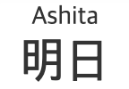

# HTML 요소 참고서(HTML elements reference)
모든 HTML 요소의 목록과 시멘틱 마크업(Semantic Markup)을 위한 요소별 설명을 다루고 있습니다.

<br />

## HTML 요소 목록(HTML elements list)
`<body>` 요소 내에서 쓰이는 요소들을 기능별로 분류한 목록입니다.

<br />

### Content sectioning
구획 요소를 사용해 페이지 콘텐츠의 큰 틀을 잡을 수 있습니다. 
- `<header>`
- `<footer>`
- `<main>`
- `<section>`
- `<aside>`
- `<address>`
- `<article>`
- `<nav>`
- `<h1>-<h6>`
- `<hgroup>`

    > 다수의 `<h1>-<h6>` 요소를 묶을 때 사용합니다.

<br />

### Text content
해당 콘텐츠의 목적이나 구조 판별에 사용하므로 접근성과 SEO(검색 엔진 최적화)에 중요합니다.
- `<div>`
- `<main>`
- `<ul>`/`<ol>`/`<li>`
- `<dl>`/`<dt>`/`<dd>`
- `<p>`
- `<hr />`

    > 이야기 장면 전환, 구획 내 주제 변경 등, 문단 레벨 요소에서 주제의 분리를 나타냅니다.
- `<pre>`

    > 미리 서식을 지정한 텍스트를 나타내며, HTML에 작성한 내용 그대로 표현합니다.
- `<blockquote>`
- `<figure>`
- `<figcaption>`


<br />

### Inline text semantics
텍스트의 의미, 구조, 스타일을 정의할 수 있습니다.
- `<a>`
- `<abbr>`
- `<b>`
- `<bdo>`
- `<br />`
- `<cite>`
- `<code>`
- `<data>`
- `<dfn>`
- `<em>`/`<strong>`
- `<i>`
- `<kbd>`
- `<mark>`
- `<q>`
- `<ruby>`
- `<sub>`/`<sup>`
- `<u>`
- `<span>`
- `<time>`
>  더 많은 요소와 설명을 [여기](https://developer.mozilla.org/ko/docs/Web/HTML/Element)에서 볼 수 있습니다.

<br />

### Image and multimedia
사진, 오디오, 비디오 등 다양한 멀티미디어 리소스를 지원하는 요소입니다.
- ``
- `<audio>`
- `<video>`
- `<map>`

    > 이미지 맵(클릭 가능한 링크 영역)을 정의할 때 사용합니다.
- `<area>`

    >  이미지의 핫스팟 영역을 정의하고, 하이퍼링크를 추가할 수 있습니다. `<map>` 요소 안에서만 사용할 수 있습니다.
- `<track>`

    > 미디어 요소(`<audio>`, `<video>`)의 자식으로서, 자막 등 시간별 텍스트 트랙(시간 기반 데이터)를 지정할 때 사용합니다.

<br />

### Embedded content
일반적인 멀티미디어 콘텐츠 이외의 콘텐츠를 포함하는 요소입니다.
- `<iframe>`
- `<embed>`
- `<object>`
- `<param>`
- `<picture>`
- `<source>`

<br />

### Scripting
동적인 콘텐츠와 웹 어플리케이션을 위해 스크립트 언어(주로 JavaScript)를 지원하는 요소입니다.
- `<script>`
- `<noscript>`
- `<canvas>`

<br />

### Demarcating edits
텍스트의 특정 부분이 수정됐다는 것을 표시하는 요소입니다.
- `<del>`
- `<ins>`

<br />

### Table content
표 형식의 데이터를 나타내는 요소입니다.
- `<table>`
- `<thead>`/`<tbody>`
- `<th>`/`<tr>`/`<td>`
- `<caption>`
- `<col>`
- `<colgroup>`

<br />

### Form
웹 서버에 데이터를 제출하기 위해 사용하는 양식(Form)을 구성하는 요소입니다. 여러가지 입력 가능한 요소를 제공합니다.
- `<form>`
- `<input />`
- `<label>`
- `<button>`
- `<select>`
- `<datalist>`
- `<option>`/`<optgroup>`
- `<textarea>`
- `<output>`
- `<progress>`
- `<fieldset>`
- `<legend>`
- `<meter>`

<br />

### Interactive elements
상호작용 가능한 사용자 인터페이스 객체를 만들 때 사용할 수 있는 요소입니다.
- `<details>`
- `<dialog>`
- `<menu>`
- `<summary>`

<br />

### Web Components
완전히 새로운 형태의 요소를 생성한 후 일반적인 HTML처럼 사용할 수 있는 기술을 지원하는 요소입니다.
- `<slot>`
- `<template>`

<br />
<br />

## `<h1> - <h6>`
제목의 정보를 사용해 자동으로 문서 콘텐츠의 표를 만드는 등의 작업을 수행할 수 있습니다. 제목 구획 단계는 `<h1>`이 가장 높고 `<h6>`은 가장 낮습니다.

- 글씨 크기를 위해 제목 태그를 사용하지 마세요. 대신 CSS의 `font-size` 속성을 사용하세요.
- 제목 단계를 건너뛰는 것을 피하세요. 언제나 `<h1>`로 시작해서 순차적으로 기입하세요.
- 페이지 당 하나의 `<h1>`만 사용하세요. `<h1>`은 가장 중요한 제목이므로 전체 페이지의 목적을 설명하고 이는 SEO(검색 엔진 최적화)와 연결됩니다.

<br />

## `<header>`
제목, 로고, 검색 폼, 작성자 이름 등의 요소를 포함할 수 있습니다.

- `<header>` 또는 `<footer>`가 자손으로 올 수 없습니다.

<br />

## `<footer>`
구획의 작성자, 저작권 정보, 관련 문서 등의 내용을 담습니다.

- `<header>` 또는 `<footer>`가 자손으로 올 수 없습니다.
- `<address>` 요소로 감싼 작성자 정보를 `<footer>` 요소에 배치하세요.

> 접근성 고려사항 : [VoiceOver](https://help.apple.com/voiceover/mac/10.15/) 스크린 리더는 랜드마크 로터에서 푸터의 랜드마크 역할을 표현하지 않는 문제가 있습니다. 해결하려면 `<footer>`에 `role="contentinfo"`를 추가하세요.

<br />

## `<main>`
문서 `<body>`의 주요 콘텐츠를 나타냅니다. 

- IE 지원이 불가합니다. 
- (`hidden` 속성 없이는) 문서 전체에 하나의 `<main>` 요소만 존재해야 합니다.
- 해당 문서만의 유일한 내용을 담아야 합니다. 사이드바, 탐색 링크, 저작권 정보, 사이트 로고, 검색 Form 등 여러 문서에 걸쳐 반복되는 콘텐츠는 포함해선 안됩니다. 그러나 검색 폼이 페이지의 주요 기능이라면 예외로 둘 수 있습니다.
- 개요에 영향을 주지 않습니다. `<body>` 등의 요소나 `<h2>`와 같은 제목 요소와 달리, `<main>`은 페이지의 개념적 구조를 바꾸지 않으며 온전히 정보 제공용입니다.

> 브라우저 호환성 이슈 : Internet Explorer 11 이하를 지원할 땐 `<main>` 요소에 `"main"` [role](https://developer.mozilla.org/en-US/docs/Web/Accessibility/ARIA/ARIA_Techniques#Landmark_roles) [ARIA](https://developer.mozilla.org/en-US/docs/Web/Accessibility/ARIA/ARIA_Techniques) 역할을 명시해 접근성을 확보하는 것이 좋습니다.

```html
<main role="main">
  ...
</main>
```

<br />

## `<article>`
독립 적으로 구분해 배포하거나 재사용 할 수 있는 구획을 나타냅니다. 사용 예제로 게시판과 블로그 글, 매거진이나 뉴스 기사 등이 있습니다. 

- 예를 들어, 사용자가 스크롤하면 계속해서 다음 글을 보여주는 블로그의 경우, 각각의 글이 `<article>` 요소가 될 수 있고, 그 안에는 또 여러 개의 `<section>`이 존재할 수 있습니다.
- 주로 제목 요소(`<h1>` ~ `<h6>`)를 포함하여 각각의 <article>을 식별합니다.
- `<article>` 요소 안에 <article> 요소를 중첩할 수 있습니다.
- 작성자 정보를 `<address>` 요소를 이용하여 제공할 수 있습니다. 그러나 중첩 `<article>`에는 적용되지 않습니다.
- 작성일자와 시간은 `<time>` 요소의 `datetime` 속성을 이용하여 설명할 수 있습니다.

<br />

## `<section>`
독립적인 구획을 나타내며, 문서 요약에 해당 구획이 논리적으로 나타나야 할 때 사용합니다.

> 요소의 콘텐츠를 외부와 구분하여 단독으로 묶는 것이 나아보인다면 `<article>` 요소가 더 좋은 선택일 수 있습니다.

- 주로 제목 요소(`<h1>` ~ `<h6>`)를 포함하여 각각의 <article>을 식별합니다.
- `<section>` 요소는 `<address>`의 자손이 될 수 없습니다.
- `<section>` 요소를 일반 컨테이너로 사용하지 마세요. 특히 단순한 스타일링이 목적이라면 `<div>` 요소를 사용해야 합니다.

<br />

## `<aside>`
문서의 주요 내용과 간접적으로만 연관된 부분을 나타냅니다. 주로 사이드바 혹은 콜아웃 박스로 표현합니다.

- `<aside>` 요소는 `<address>`의 자손이 될 수 없습니다.

다음 예제는 글 내의 문단을 `<aside>`로 표시합니다. 해당 문단은 글의 주제와 간접적으로만 연결되어 있습니다.
```html
<article>
  <p>
    디즈니 만화영화 <em>인어 공주</em>는
    1989년 처음 개봉했습니다.
  </p>
  <aside>
    인어 공주는 첫 개봉 당시 8700만불의 흥행을 기록했습니다.
  </aside>
  <p>
    영화에 대한 정보...
  </p>
</article>
```

<br />

## `<nav>`
현재 페이지 내, 또는 다른 페이지로의 링크를 보여주는 구획을 나타냅니다. 자주 쓰이는 예제는 메뉴, 목차, 색인입니다.

- 문서의 모든 링크가 `<nav>` 요소 안에 있을 필요는 없습니다. `<nav>` 요소는 주요 탐색 링크 블록을 위한 요소입니다. 대개 `<footer>` 요소가 `<nav>`에 들어가지 않아도 되는 링크를 포함합니다.
- 하나의 문서에서 여러 개의 `<nav>` 태그를 가질 수 있습니다. 이럴 때 [`aria-labelledby`](https://developer.mozilla.org/ko/docs/Web/Accessibility/ARIA/ARIA_Techniques/Using_the_aria-labelledby_attribute) 를 사용해 접근성을 향상할 수 있습니다.
- 스크린 리더 등 장애를 가진 사용자를 위한 사용자 에이전트는 최초 렌더링에서 탐색 전용 콘텐츠를 제외할지 결정할 때 `<nav>`를 참고합니다.

<br />

## `<address>`
사람, 단체, 조직 등에 대한 연락처 정보를 나타냅니다. 또한 `<article>` 내부에 배치해서 글의 작성자를 나타낼 수도 있습니다.

- `<address>` 요소는 `<address>`를 부모 요소로 가질 수 없습니다.
- `<address>` 요소 안에 반드시 포함해야 하는 정보는 연락처가 가리키는 개인, 조직, 단체의 이름입니다.
- 연락처 외의 정보(출판일 등)를 담아서는 안됩니다.

<br />

### 예제
```html
<address>
	<a href="mailto:imdud0612@gmail.com">imdud0612@gmail.com</a><br />
	<a href="tel:+13115552000">(311) 555-2000</a>
</address>
```

`<a href="mailto:...">` 를 클릭하면, 각 플랫폼에서 지원하는 메일 쓰기 페이지/앱으로 이동합니다. <br />
`<a href="tel:...">` 를 클릭하면, 각 플랫폼에서 지원하는 전화 앱으로 이동합니다.

<br />

## `<div>`
아무 의미가 없는 영역을 나타냅니다. 스타일링 목적으로 사용합니다.

<br />

## `<ul>`/`<ol>`/`<li>`
순서가 있는 목록(`<ol>`) / 순서가 없는 목록(`<ul>`)에 사용합니다. `<li>` 태그는 목록의 각 아이템입니다.

- `<ol>`과 `<ul>`은 자식으로 `<li>`만 올 수 있습니다.
- `<li>`는 단독으로 사용할 수 없습니다.
- 항목의 순서를 바꿨을 때 의미도 바뀐다면 `<ol>`을 사용하세요. (단계별 요리법, 내비게이션, 영양정보에서 비율의 내림차순으로 정렬한 원재료 목록)
- `<ul>` 요소에서 스타일적 요소의 넘버링이 필요하다면 CSS의 list-style 속성으로 제어할 수 있습니다.

<br />

### `<ul>` 요소의 특성
- `type` : 넘버링 타입 ()

    - `a` : lowercase letters
    - `A` : uppercase letters
    - `i` : lowercase Roman numerals
    - `I` : uppercase Roman numerals
    - `1` : numbers (default)
    
        > `<li>` 태그에 별도로 `type` 속성을 명시하지 않으면 `<ol>` 태그의 `type` 속성이 적용됩니다. 

- `reversed` : 역순 정렬 (Boolean)
- `start` : 아이템에 넘버링을 할 때 첫 번째 순서를 나타내는 숫자

     > type 값이 A와 같이 문자이더라도, start 속성 값은 3과 같이 숫자만 지정할 수 있습니다.

<br />

### 예제
```html
<ol type="1" reversed>
	<li>Mix flour, baking powder, sugar, and salt.</li>
	<li>In another bowl, mix eggs, milk, and oil.</li>
	<li>Stir both mixtures together.</li>
	<li>Fill muffin tray 3/4 full.</li>
	<li>Bake for 20 minutes.</li>
</ol>
```

<br />

### `<li>` 요소의 특성

- `value` : `<ol>` 요소 내부에서 이 값에서부터 번호를 매깁니다. 숫자만 넣을수 있습니다. 

> 부모 `<ol>` 요소에서 지정하는 유형을 덮어쓰는 `type` 속성은 사용이 중단됐습니다. 대신 CSS [list-style-type](https://developer.mozilla.org/ko/docs/Web/CSS/list-style-type) 속성을 사용하세요.

<br />

## `<dl>`/`<dt>`/`<dd>`
`<dl>` 태그는 설명 그룹의 목록을 나타냅니다. 설명 그룹은 용어(`<dt>`) + 정의(`<dd>`)를 한 그룹으로 합니다. 주로 용어사전 구현이나 메타데이터(키-값 쌍 목록)를 표시하는데 사용합니다. <br />
(Definition Term / Definition Details / Description List)

- `<dl>`은 `<dd>`, `<dt>`만을 포함해야 합니다.

<br />

### Styling
용어 그룹을 묶어서 스타일링할 때 `<div>` 태그를 사용할 수 있습니다.

```html
<dl>
	<div>
		<dt>Beast of Bodmin</dt>
		<dd>A large feline inhabiting Bodmin Moor.</dd>
	</div>

	<div>
		<dt>Morgawr</dt>
		<dd>A sea serpent.</dd>
	</div>

	<div>
		<dt>Owlman</dt>
		<dd>A giant owl-like creature.</dd>
	</div>
</dl>
```

<br />

### 웹 접근성 고려
일부 스크린 리더는 `<dl>`의 콘텐츠를 리스트로 표현하지 않습니다. 따라서, 각 아이템의 콘텐츠는 리스트 그룹 내 다른 항목과의 관계를 표현할 수 있는 방식으로 작성해야 합니다. <br /><br />
웹 접근성을 고려하여 `<ul>`과 `<dfn>` 태그를 사용할 수 있겠네요.

> `<dfn>`은 용어 하나를 정의하는 태그입니다.

```html
<ul>
	<li>
		<dfn>Beast of Bodmin</dfn>
		<p>A large feline inhabiting Bodmin Moor.</p>
	</li>

	<li>
		<dfn>Morgawr</dfn>
		<p>A sea serpent.</p>
	</li>

	<li>
		<dfn>Owlman</dfn>
		<p>A giant owl-like creature.</p>
	</li>
</ul>
```

<br />

## `<p>`
하나의 문단을 나타냅니다. HTML에서 문단은 이미지나 입력 폼 등 서로 관련있는 콘텐츠 무엇이나 될 수 있습니다.

- 콘텐츠를 문단으로 나누면 페이지의 접근성을 높입니다. 스크린 리더 등의 보조 기기는 `<p>` 태그를 사용하여 다음 문단으로 넘어갈 수 있는 단축키 등을 제공합니다.

<br />

### 닫는 태그 생략
자신의 닫는 태그(`</p>`) 이전에 다른 블록 레벨 태그가 분석되면 자동으로 닫힙니다.

> 닫는 태그는 `<p>` 요소의 바로 뒤에 `<address>`, `<article>`, `<aside>`, `<blockquote>`, `<div>`, `<dl>`, `<fieldset>`, `<footer>`, `<form>`, `<h1>-<h6>`, `<header>`, `<hr>`, `<menu>`, `<nav>`, `<ol>`, `<pre>`, `<section>`, `<table>`, `<ul>`, `<p>` 요소가 위치하는 경우, 또는 부모 태그의 콘텐츠가 더 존재하지 않고 부모가 `<a>` 요소가 아닐 때 생략할 수 있습니다.

<br />

## `<hr />`
문단을 분리합니다. 이야기 장면 전환, 구획 내 주제 변경 등 문단 레벨에서 주제의 분리를 나타냅니다.
> (Horizontal Rule)

- `<hr>`은 브라우저에서 시각적인 가로줄로 그려질 뿐만 아니라, 의미를 가집니다. 

<br />

### 예제
```html
<p>
This is the first paragraph of text. 
This is the first paragraph of text.
</p>

<hr>

<p>
This is second paragraph of text. 
This is second paragraph of text.
</p>
```

<br />

### Styling
`<hr />` 요소는 사실 단순한 가로줄이 아닌, 납작한 박스 형태입니다. 기본적으로 모든 요소는 사각형의 박스 형태를 하고 있죠. 따라서 `border` 속성 값을 아래와 같이 작성하면, 해당 `<hr />` 요소가 그려내는 가로줄의 두께는 2px이 됩니다.

```html
hr {
	border: 1px solid tomato;
}
```

가로줄을 숨기거나 꾸미려면 브라우저마다 제각각 적용된 `border` 스타일을 제거하세요. (`border: none`) 쓰면 됩니다.

```html
hr {
	border: none;
	border-top: 1px solid tomato;
}
```
위와 같이 하면 `<hr />` 가로줄의 두께는 1px 입니다.

<br />

## `<pre>`
미리 서식을 지정한 텍스트를 나타내며, HTML에 작성한 내용 그대로 표현합니다. 내부에 [구문 콘텐츠](https://developer.mozilla.org/ko/docs/Web/Guide/HTML/Content_categories#%EA%B5%AC%EB%AC%B8_%EC%BD%98%ED%85%90%EC%B8%A0) 태그만 사용할 수 있습니다.
> (Preformatted Text)

<br />

### 접근성 고려사항
`<pre>` 요소로 만든 이미지나 도표에 대한 대체 설명을 지정하는 것이 중요합니다. 

```html
<figure role="img" aria-labelledby="cow-caption">
  <pre>
  _______________________
< 나는 이 분야의 전문가다. >
  -----------------------
         \   ^__^ 
          \  (oo)\_______
             (__)\       )\/\
                 ||----w |
                 ||     ||
  </pre>
  <figcaption id="cow-caption">
    소 한 마리가 "나는 이 분야의 전문가다"라고 말하고 있습니다. 소는 미리 서식을 적용한 텍스트로 그려져있습니다.
  </figcaption>
</figure>
```

위의 예시에서는 `<figure>`, `<figcaption>` 태그, `id` 속성, ARIA `role`, `aria-labelledby` 속성을 조합하여 사용했습니다. `<pre>` 요소를 마치 이미지처럼 표현하면서 `<figcaption>` 요소를 사용하여 대체 설명을 제공하고 있습니다.

<br />

## `<blockquote>`
텍스트가 긴 인용문임을 나타냅니다. 주로 들여쓰기를 한 것으로 그려집니다.
> (Block Quotation)

- 인용문의 들여쓰기를 바꾸려면 CSS `margin-left`와 `margin-right`를 사용하세요.
- 별도의 블록을 쓰지 않아도 될 짧은 인용문은 `<q>` 요소를 사용하세요.

<br />

 속성|의미|값
 ---|---|---
 cite|인용문의 맥락 혹은 출처 정보를 가리키는 URL|URL
 
 <br />
 
 ### 예제
 ```html
<blockquote cite="https://www.huxley.net/bnw/four.html">
	<p>
		Words can be like X-rays, if you use them properly—they’ll go through
		anything. You read and you’re pierced.
	</p>
	<footer>—Aldous Huxley, <cite>Brave New World</cite></footer>
</blockquote>
```

<br />

## `<a>`
다른 페이지나 같은 페이지의 어느 위치(`#id`), 파일, 이메일 주소와 그 외 다른 URL로 연결할 수 있는 하이퍼링크를 만듭니다. 
> Anchor

- `href` 특성을 통해 다른 URL로 이동할 수 있습니다.
- `<a>` 안의 콘텐츠는 링크 목적지의 설명을 나타내야 합니다.

<br />

### `<a>`요소의 특성
- `download` : 링크로 이동하는 대신 사용자에게 URL을 저장할지 물어봅니다. 값을 지정하면 저장할 때의 파일 이름으로서 제안합니다. `/`와 `\` 문자는 `_`로 변환합니다. 값이 없으면 파일 이름과 확장자는 브라우저가 다양한 인자로부터 생성해 제안합니다.
    > `download`는 [동일 출처 URL](https://developer.mozilla.org/ko/docs/Web/Security/Same-origin_policy) 과 `blob:`, `data:` 스킴에서만 작동합니다.
                                                                                                                                               
- `href` : 하이퍼링크가 가리키는 URL. 링크는 HTTP 기반 URL일 필요는 없고, 브라우저가 지원하는 모든 URL 스킴을 사용할 수 있습니다.
    - `tel:` URL을 사용하는 전화번호
    - `mailto:` URL을 사용하는 이메일 주소
- `ping` : 브라우저가 URL 각각에 POST 요청을 전송합니다. 대개 추적 용도로 사용합니다.
- `rel` : 연결한 URL과의 관계를 나타내는 [링크 유형](https://developer.mozilla.org/ko/docs/Web/HTML/Link_types) 목록입니다.
- `target` : 링크한 URL을 표시할 위치를 나타냅니다. 탭, 창, `<iframe>`의 이름이나 의미를 가지는 특정 키워드입니다.

    - `_self` : 현재 탭/창(기본값)
    - `_blank` : 새 탭/창
    - `_parent` : 현재 탭/창의 부모
    
        > 부모가 존재하지 않으면 `_self`와 동일하게 행동합니다.
                                      >
    - `_top` : 최상단 탭/창
    
        > 부모가 존재하지 않으면 `_self`와 동일하게 행동합니다.

<br />

### 보안 취약성
`target` 특성을 사용할 때, `rel="noreferrer"`를 추가해 `window.opener` API의 악의적인 사용을 방지하는걸 고려하세요.
> [Target="_blank" - the most underestimated vulnerability ever](https://www.jitbit.com/alexblog/256-targetblank---the-most-underestimated-vulnerability-ever/)

<br />

## `<abbr>`
약어를 나타냅니다. 선택 속성인 `title`을 사용하면 준말의 전체 뜻이나 설명을 제공할 수 있습니다.
> Abbreviation

- `title` 속성 값은 전체 설명만을 작성하며, 다른건 포함할 수 없습니다.
- `title` 속성은 약어에 대한 설명/확장 형태를 사람이 읽을 수 있는 형태로 나타내야 합니다.
- 브라우저는 `title`의 값을 보통 마우스 커서를 올렸을 때 나타나는 툴팁(Tooltip)으로 보여줍니다.
- 설명 없이 단순히 해당 글자가 준말임을 나타내기만 하려면 `<abbr>` 태그를 속성 없이 사용하세요.
- `<abbr>`을 `<dfn>`과 같이 사용하면 준말이나 머리글자를 그 정의와 연결할 수 있습니다. 

<br />

### Styling
```css
abbr {
	font-variant: all-small-caps;
}
```

<br />

### 예제
```html
<abbr title="Cascading Style Sheets">CSS</abbr>
```

<br />

## `<b>`
독자의 주의를 끌기 위해 사용합니다.
> Bring Attention

- 다른 태그가 적합하지 않은 경우 마지막 수단으로 사용하며 특별한 의미를 가지지 않습니다.
- 기본적으로 글자가 두껍게(Bold) 표시됩니다.

<br />

## `<mark>`
맥락 내에서 사용자의 관심을 끌기 위해 하이라이트 효과를 줄 때 사용합니다.

- 기본적으로 형광펜을 사용한 것처럼 글자 배경이 노란색(Yellow)으로 표시됩니다.
- 인용문(`<q>`, `<blockquote>`)에서 주시해야 할 필요가 있는 부분을 표시합니다.
- 다른 경우, `<mark>`는 사용자와 관련하여 사용자가 검색한 현재 검색 키워드를 강조 표시할 때 사용할 수 있습니다.

> `<mark>`와 `<strong>` 요소의 차이점을 기억하세요. 텍스트에서, `<mark>`는 연관성을 가진 부분을, `<strong>`은 중요도를 가진 부분을 나타낼 때 사용합니다.

<br />

### 접근성 고려사항
대부분의 스크린 리더는 기본값에서 `<mark>` 요소의 존재를 표현하지 않습니다. 그러나 CSS content 속성과 ::before, ::after 의사 요소를 사용하면 소리내어 읽도록 할 수 있습니다.
```css
mark::before, 
mark::after {
  clip-path: inset(100%);
  clip: rect(1px, 1px, 1px, 1px);
  height: 1px;
  overflow: hidden;
  position: absolute;
  white-space: nowrap;
  width: 1px;
}

mark::before {
  content: " [강조 시작] ";
}

mark::after {
  content: " [강조 끝] ";
}
```

> 일부 사용자에게는 지나치게 자세한 안내를 유발할 수 있으므로 이 방식을 남용해서는 안됩니다. 콘텐츠의 이해에 강조표시의 유무가 꼭 필요할 때만 사용해야 합니다.

<br />

## `<em>`
단순한 의미 강조를 표시합니다. 
> Emphasis

> `<em>`은 콘텐츠를 강조하지만, `<i>`는 외국어, 등장인물의 생각 등 일반적인 산문에서 벗어난 경우 사용합니다.

- 중첩될수록 강조 의미가 강해집니다.
- 스크린 리더에서 구두 강조로 발음됩니다.
- 기본적으로 이탤릭체(Italic type)로 표시됩니다.

<br />

## `<strong>`
중대하거나 긴급한 콘텐츠를 나타냅니다.
> Strong importance

<br />

### 예제
```html
<p>Before proceeding, <strong>make sure you put on your safety goggles</strong>.</p>
```

<br />

## `<i>`
텍스트에서 어떤 이유로 주위와 구분해야 하는 부분, 주변과 톤이 다른 부분에 사용합니다. (기술 용어, 외국어 구절, 등장인물의 생각, 아이콘 등)

- 기울임꼴(italic)로 표시됩니다.
- 강조하려는 텍스트가 다른 요소에 더 적합하지 않은지 고려하세요.
    - `<em>` 태그는 강세를 나타냅니다.
    - `<strong>` 태그는 보다 강한 강조를 나타냅니다.
    - `<mark>` 태그는 관련성을 나타냅니다.
    - `<cite>` 태그는 책, 공연, 음악 등 저작물의 이름을 나타냅니다.
    - `<dfn>` 태그는 정의 대상인 용어를 나타냅니다.

<br />

## `<dfn>`
정의하고 있는 용어를 나타냅니다. `<dfn>`에서 가장 가까운 `<p>`, `<dt>`/`<dd>` 쌍, `<section>` 조상 요소를 용어 정의로 간주합니다.

- `<dfn>` 요소가 `title` 특성을 가지고 있으면 그 값을 현재 정의 중인 용어로 간주합니다. 
- `<dfn>`이 자식으로 `title` 특성을 가진`<abbr>`을 가지는 경우, 자식 `<abbr>`의 `title` 특성 값을 현재 용어로 간주합니다.
- `<dfn>` 요소에 `id` 특성을 지정하면 `<a>` 요소로 `<dfn>`을 가리킬 수 있습니다.

<br />

### 예제
```html
<p>The <strong>HTML Definition element</strong>
(<strong><dfn id="definition-dfn">&lt;dfn&gt;</dfn></strong>) is
used to indicate the term being defined within the context of a
definition phrase or sentence.</p>

<p>Because of all of that, we decided to use the
<code><a href="#definition-dfn">&lt;dfn&gt;</a></code> element for
this project.</p>
```
코드 뒤쪽에서는 `<a>` 태그와 `href` 특성 값 `"#definition-dfn"`으로, 정의를 가리키는 링크를 생성합니다.

<br />

## `<cite>`
저작물의 출처를 표기할 때 사용하며, 제목을 반드시 포함해야 합니다.

- W3C 명세는 `<cite>` 요소로 저작물의 출처를 표기할 때 저작자도 표기할 수 있음을 명시하고 있습니다. 그러나 정반대로, WHATWG 명세는 사람 이름을 어떤 상황에서도 절대 포함하지 말아야 한다고 적혀있다는 점을 알아두는 것이 좋습니다.

<br />

## `<q>`
짦은 인용문
> Quotation

- `<q>`는 줄 바꿈이 없는 짧은 경우에 적합합니다. 긴 인용문은 `<blockquote>` 요소를 사용하세요.
- 인용문의 출처 문서나 메시지를 가리키는 URL을 사용하기 위해 `cite` 특성을 이용할 수 있습니다.

<br />

## `<u>`
HTML 5에서 `<u>` 요소는 텍스트가 일종의 문자가 아닌 주석(Non-textual annotation)을 가지고 있음을 나타냅니다. 철자 오류 강조, 중국어의 고유 명사 표시 등에 주로 쓰입니다.
> Unarticulated Annotation

- `<u>`를 사용해 밑줄만 추가하거나, 책 제목 등을 강조해서는 안됩니다.

    > 아무런 의미를 나타내지 않고 밑줄만 추가할 경우 `<span>` 요소를 사용하고, `text-decoration` 속성의 값은 `underline`으로 지정하세요.

<br />

### 예제

```html
<p>맞춤법을 틀리면 <u class="spelling">않돼요</u>.</p>
```

<br />

## `<code>`
짧은 코드 조각을 나타냅니다.

- 여러 줄의 코드를 나타내려면 `<code>` 요소를 `<pre>`로 감싸세요. 보통 상황에서 `<code>`는 코드 한 줄만 나타냅니다.
```html
<p>The <code>push()</code> method adds one or more elements to the end of an array and returns the new length of the array.</p>
```

<br />

## `<kbd>`
텍스트 입력 장치(키보드)에서 키보드 입력, 음성 입력을 나타냅니다.
> Keyboard Input

- `<kbd>` 요소를 다른 `<kbd>` 요소 안에 배치해, 하나의 입력 안의 작은 부분이나, 실제 타이핑 키를 하나씩 나타낼 수 있습니다.

```html
<p>Please press <kbd>Ctrl</kbd> + <kbd>Shift</kbd> + <kbd>R</kbd> to re-render an MDN page.</p>
```

<br />

## `<sup>`/`<sub>`
위 첨자(`<sup>`)와 아래 첨자(`<sub>`)를 표시할 때 사용합니다.
> Superscripted text, Subscripted text

- `<sup>`/`<sub>` 요소는 기존의 관례나 표준이 아래 첨자로 나타내는 경우(타이포그래피)에만 써야 하며, 단순히 작은 글자를 아래로 올려야 할 때는 사용해서는 안됩니다.

    > 단순히 글씨 기준선을 올리거나 내려야 한다면 CSS `vertical-align: super`/`vertical-align: sub`를 사용할 수 있습니다. 기준선을 25% 내려야 한다면 `vertical-align: -25%`로 씁니다. 

```html
X<sup>4</sup> + Y<sup>2</sup>, H<sub>2</sub>O
```

<br />

## `<time>`
시간의 특정 지점 또는 구간을 나타냅니다. `datetime` 속성을 지정하면 적절한 검색 결과, 알림 같은 특정 기능을 구현할 때 사용할 수 있습니다.

- `datetime` 특성이 없는 경우 어떠한 자식 요소도 두어서는 안되며, 요소의 텍스트 콘텐츠를 `datetime` 특성 값으로 간주합니다.

```html
<time datetime="2018-07-07">July 7</time>

<time datetime="20:00">20:00</time>

<time datetime="PT2H30M">2h 30m</time>
```
> [유효한 datetime 값](https://developer.mozilla.org/ko/docs/Web/HTML/Element/time) 을 확인하세요.

<br />

## `<span>`
본질적으로는 아무것도 나타내지 않습니다. 주로 스타일을 적용하기 위해 사용합니다.

<br />

## `<br />`
텍스트 안에 줄바꿈(캐리지 리턴)을 생성합니다. (주소나 시조 등 줄의 구분)

- 문단 사이에 여백을 두기 위한 용도로 `<br />`을 사용하지 마세요.
- `<br />` 요소에 CSS `margin`을 적용하면 줄 간격을 늘릴 수 있겠지만 좋은 방법은 아닙니다. 줄 간격은 `line-height` 속성을 사용하세요.
- 웹 접근성을 위해서는 `<br />` 대신 `<p>` 요소와 함께 CSS `margin` 속성 등을 조합해 간격을 조절하세요.

<br />

## `<data>`
주어진 콘텐츠를 기계가 읽을 수 있는 해석본과 연결합니다.

- 콘텐츠가 시간 혹은 날짜 관련 정보라면 대신 `<time>` 요소를 사용하세요.
- 기계가 읽을 수 있는 형태의 콘텐츠 해석본은 `value` 특성으로 표시합니다.

<br />

### 예제
```html
<p>New Products:</p>
<ul>
    <li><data value="398">Mini Ketchup</data></li>
    <li><data value="399">Jumbo Ketchup</data></li>
    <li><data value="400">Mega Jumbo Ketchup</data></li>
</ul>
```
상품의 이름을 표시하면서, 각각의 상품 번호도 연결합니다.

<br />

## `<ruby>`
루비 주석을 나타냅니다. 루비 주석은 동아시아 문자의 발음을 표기할 때 사용합니다. 

```
<ruby>
明日 <rp>(</rp><rt>Ashita</rt><rp>)</rp>
</ruby>
```




***
### _References_
- [HTML elements reference | MDN](https://developer.mozilla.org/en-US/docs/Web/HTML/Element)
- [한눈에 보는 HTML 요소(Elements & Attributes) 총정리 | HEROPY Tech](https://heropy.blog/2019/05/26/html-elements/)